```{r include=FALSE}
library(dplyr)
library(dslabs)
library(ggplot2)
library(ggrepel)
data("heights")
```

### Введение в принципы визуализации данных

Уже были приведены некоторые правила, поскольку создали графики на основе примеров.

Здесь некоторые общие принципы, которые можно использовать в качестве руководства
для эффективной визуализации данных. Большая часть этой части курса основана на
разговоре Карла Бромана «Создание эффективных фигур и таблиц» и из примечаний
к классу от Питера Алдоуса под названием «Создание эффективных фигур и таблиц»
«Введение в визуализацию данных».

Во многих примерах придерживаемся подхода Карла. Показаны некоторые примеры стилей
гарфиков, которые следует избегать, как их улучшить, а затем использовать их как
мотивацию для перечня принципов. Сравниваем и сопоставляем графики, которые следуют
этим принципам. Принципы в основном основаны на исследованиях, связанных с тем, как
люди находят образцы и делают визуальные сравнения.

Предпочтительными подходами являются те, которые наилучшим образом соответствуют
тому, как наш мозг обрабатывает визуальную информацию. При принятии решения о подходе
к визуализации важно также помнить о нашей цели. Можем сравнивать число видимых чисел,
описывающее распределения для категорий или числовых значений, сравнивая данные из
двух групп или описывая связь между двумя переменными.

В заключение также знаем, что для научного сотрудника важно адаптировать и
оптимизировать графики для аудитории. Например, поисковый заговор, сделанный для нас,
будет отличаться от графика, предназначенного для передачи информации общей аудитории.

### Кодирование данных с использованием визуальных подсказок

Начнем с описания некоторых принципов кодирования данных. В нашем распоряжении есть
несколько подходов, в том числе положение, aligned lengths, углы, область, яркость
и цветовой оттенок.

В первом примере, чтобы проиллюстрировать, как сравниваются некоторые из этих стратегий,
предположим, что хотим сообщать результаты двух гипотетических опросов, спрашивая,
какой браузер вы используете. И опросы были сделаны в 2000 году, а затем в 2015 году.
Здесь, для каждого года, мы просто сравниваем четыре количества, четыре процента.

Широко используемое графическое представление процентов, популяризированное 
Microsoft Excel, представляет собой круговую диаграмму.

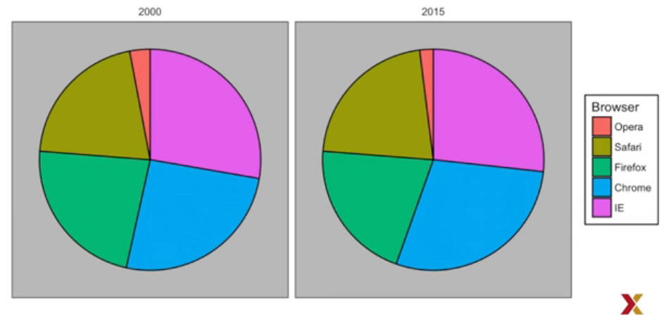

Есть две круговые диаграммы, одна на 2000 год, другая на 2015 год. Здесь мы представляем
величины с обеими областями и углами, так как угол и площадь каждого куска пирога
пропорциональны количеству, которое он представляет. Это оказывается субоптимальным
выбором, поскольку, как показывают исследования восприятия, люди не умеют точно
определять углы, и даже хуже, когда доступна только область.

Это делает Donus Chart, которая использует только область, хуже, чем круговая диаграмма.

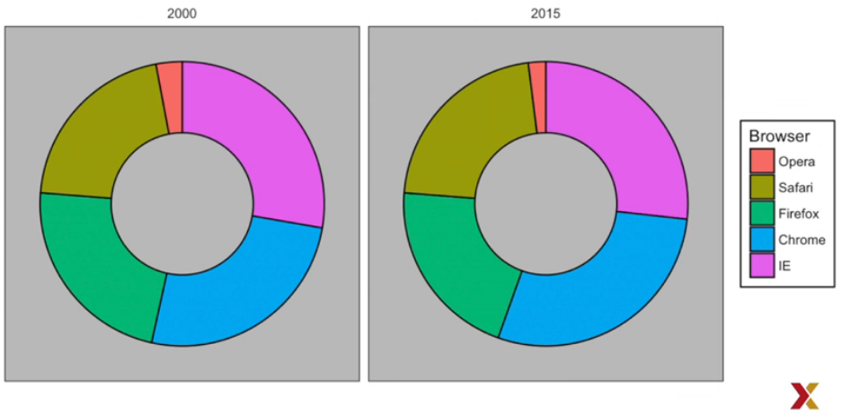

Чтобы понять, насколько сложно измерять углы и площадь, нужно обратить внимание, что
рейтинги и все проценты на участках, которые только что видели, изменились с 2000 по
2015 год. Можем ли определить фактические проценты и оценить популярность браузера?
Видно, как процентное соотношение изменилось с 2000 по 2015 год? Это нелегко сказать
по графику.

В этом случае простое отображение цифр не только понятно, но и позволяет нам сэкономить
на затратах на печать при составлении бумажной версии наших результатов. Если выпишем
проценты,то быстро увидим, какой браузер более популярен и как они изменились с 2000
по 2015 год.

| Browser | 2000 | 2015 |
|---------|------|------|
| Opera   | 3    | 2    |
| Safari  | 21   | 22   |
| FireFox | 23   | 21   |
| Chrome  | 26   | 29   |
|   IE    | 28   | 27   |

Если мы настаиваем на графике, предпочтительным способом построения этих величин является
использование длины и позиций, так как люди намного лучше оценивают линейные измерения.
Строка штриха использует этот подход, используя полосы длины, пропорциональные количеству
процентов.

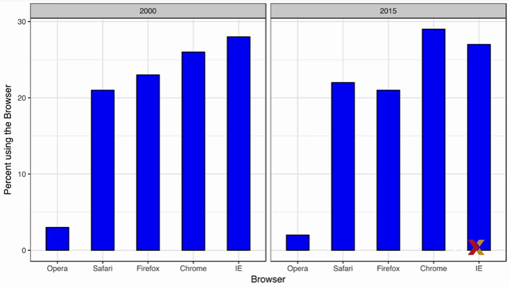

Добавляя горизонтальную линию по стратегически выбранным значениям, в этом случае
на каждом кратном 10, мы уменьшаем количественную оценку по положению верхней части
баров. Сравним эти два графика. Насколько проще видеть различия в графике?
Фактически, теперь можем определить фактические проценты, следуя горизонтальной линии
по оси y.

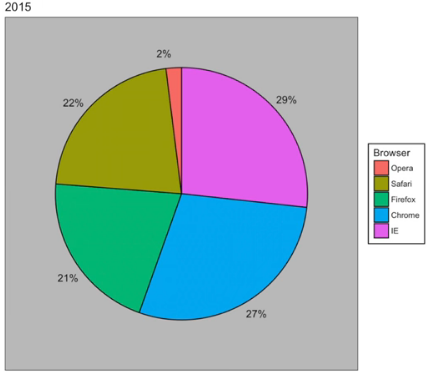

Если по какой-то причине нужно составить круговую диаграмму, включите проценты в виде
чисел, чтобы избежать необходимости выводить их из углов или области. Таким образом,
положение и длина являются предпочтительным способом отображения величин под углами,
которые предпочтительнее по площади.

Яркость и цвет еще сложнее определить, чем углы и площадь. Но, как увидим позже, они
иногда полезны, когда отображаются более двух измерений.

### Know When to Include Zero

При использовании барных заглавок нечестно не начинать бары с нуля. Это связано с тем,
что, используя график штрихов, мы подразумеваем, что длина пропорциональна отображаемым
величинам.

Избегая 0, можно сделать сравнительно небольшие различия, чтобы выглядеть намного
больше, чем они есть на самом деле. Этот подход часто используется политиками или
медиа-организациями, пытающимися преувеличивать разницу.

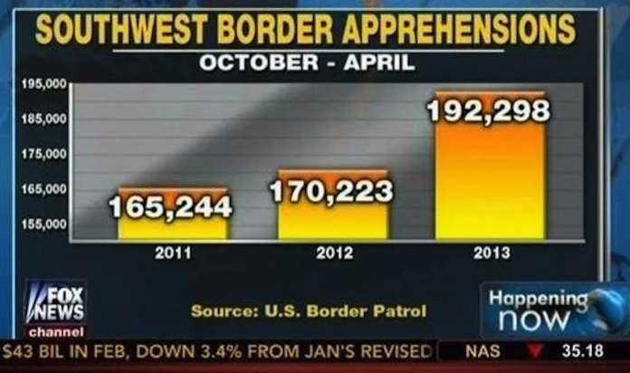

Это штриховой график, сделанный Fox News, показывающий опасения на границе с Западом в
2011, 2012 и 2013 годах.
Насколько больше баров в 2013 году выглядит по сравнению с 2011 годом. Из этого графика
кажется, что опасения почти утроились, когда на самом деле, если посмотрим на цифры. Они
только увеличились примерно на 16%.

Это то, на что похоже, если график начинается с нуля.

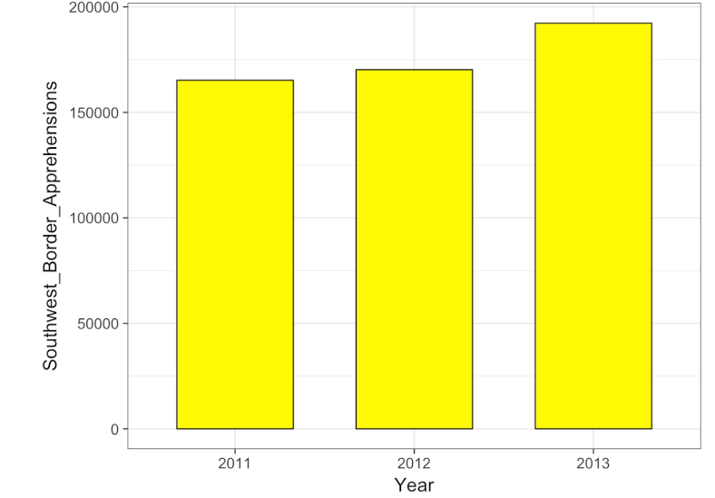

Вот еще один пример, опять же из Fox News.

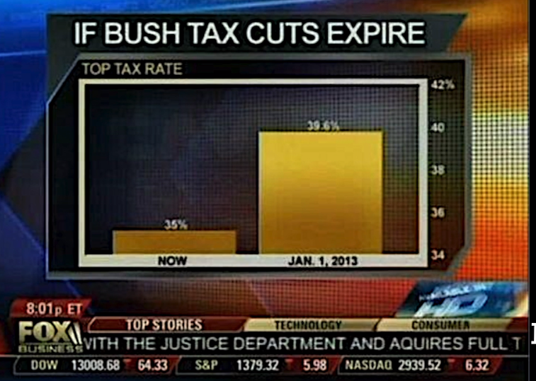

Который показывает нам, что произойдет, если сокращение налогов в Буше истекает
по верхней ставке налога, которая сравнивается с 1 января 2013 года, до времени,
когда это было передано. Похоже, что 1 января 2013 года примерно в 5 раз больше,
чем сейчас.

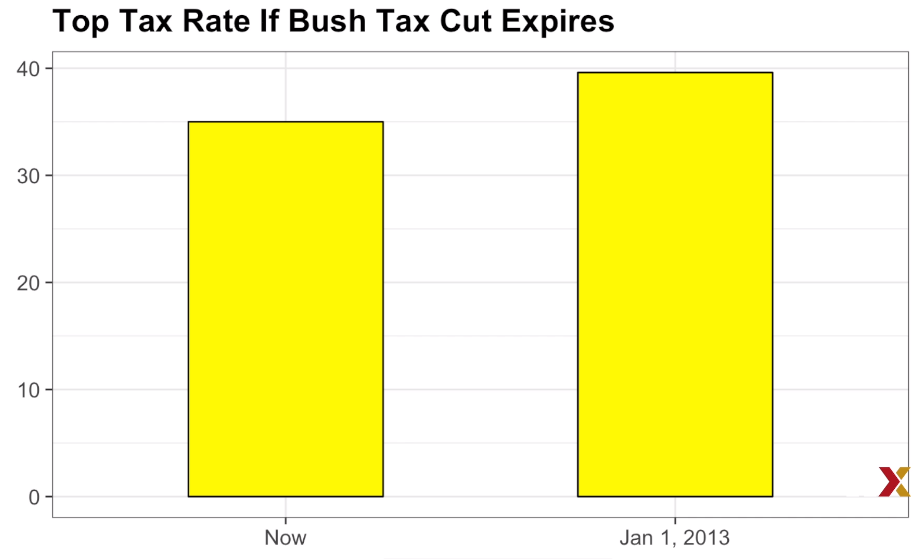

Вот как это выглядит с соответствующим графиком, совершенно другая история.
При использовании позиции, а не длины, тогда нет необходимости включать 0.

Это особенно важно, когда хотим сравнить различия между группами относительно
изменчивости, наблюдаемой в группах.

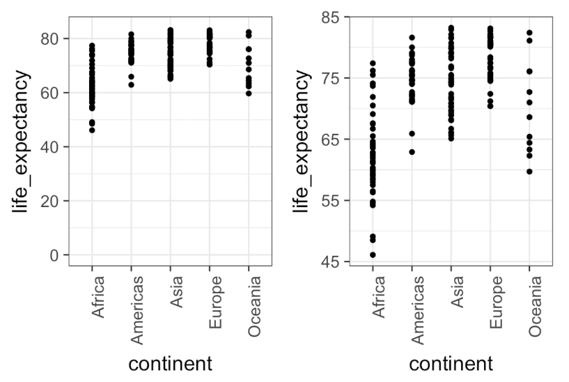

Вот иллюстративный пример, показывающий среднюю продолжительность жизни в стране,
стратифицированную на континентах, в 2012 году. На графике слева, который включает
в себя 0, пространство между 0 и 43 не добавляет никакой информации и затрудняет
оценку различий между ними и внутри них. По этой причине на графике справа мы
ограничиваем диапазон включением точек.

### Do Not Distort Quantities

Cледующий принцип не искажает величины.

Вот пример.


Во время президентства президента США Барака Обамы в 2011 году, следующая
диаграмма использовалась для сравнения ВВП США с ВВП четырех конкурирующих
стран. Отметим, что, судя по площади кругов, США, похоже, имеют экономику
в 5 раз больше, чем Китай, и в 30 раз больше, чем Франция.

Однако, глядя на фактические цифры, можно видеть, что это не так.
Фактические коэффициенты 2,6 и 5,8 раза больше, чем в Китае и Франции соответственно.
Причина этого искажения заключается в том, что радиус, а не площадь, был пропорционален
количеству, что означает, что пропорции между областями квадратичны.
Таким образом, 2.6 превращается в 6.5 и 5.8, превращается в 34.1.

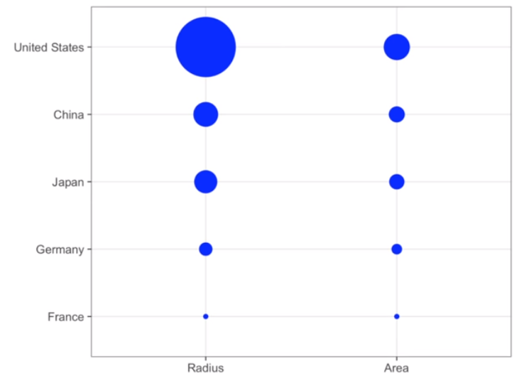

Вот сравнение кругов, которые получаются, если сделаем значения, пропорциональные
радиусу, то есть слева, а значит, и область, это справа. Неудивительно, что ggplot
по умолчанию использует область, и не радиус. Конечно, в этом случае действительно
не стоит использовать область вообще, так как мы можем использовать положение и длину.
Вот штриховой график, сравнивающий ВВП.

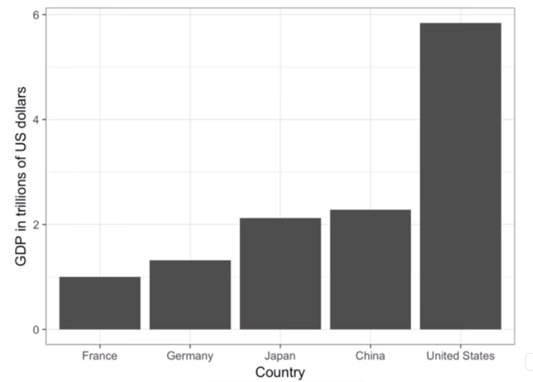

### Order by a Meaningful Value

Следующий принцип - порядок значимой ценности.

Когда одна из осей используется для отображения категорий, как это делают штриховые
графики, поведение ggplot по умолчанию заключается в упорядочении категорий в 
алфавитном порядке, если они определены символьными строками. Если они определяются
факторами, они упорядочиваются по уровням факторов.

**Но уровни факторов по умолчанию упорядочиваются по алфавиту.**
Редко когда хотим использовать алфавитный порядок. Это произвольно. Вместо этого
нужно задавали значительную величину. Во всех рассмотренных случаях штриховые
графики были упорядочены по отображаемым значениям. Исключением был график,
показывающий штриховые графики, сравнивающие ряды.

В этом случае сохранили порядок одинаково на графиках, чтобы облегчить сравнение.
Вместо этого задалвали по среднему значению 2000 и 2015 годов. Ранее узнали,
как использовать функцию reorder, которая помогает достичь этой цели.

Чтобы оценить, какой правильный порядок, чтобы помочь передать сообщение,
предположим, что хотим создать сюжет, чтобы сравнить уровень убийств по штатам.
Особенно заинтересованы в самых опасных и безопасных состояниях.

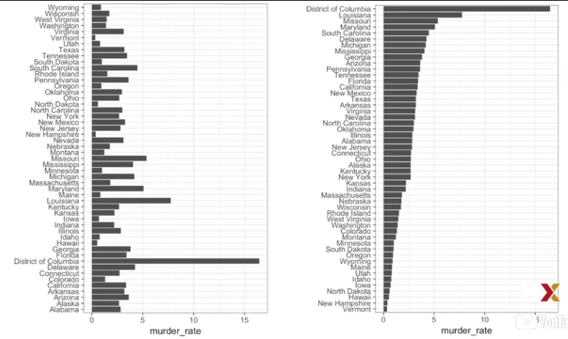

Обратите внимание на разницу, когда мы задаем по алфавиту, по умолчанию, по
сравнению с тем, когда мы задаем фактическую величину. Информация, которую хотим,
намного проще извлечь из графика. Обратите внимание, что функция переупорядочения
позволяет нам также изменять порядок групп. В более раннем видеоролике видели пример, связанный с распределением доходов по регионам.

Вот эти два графика.

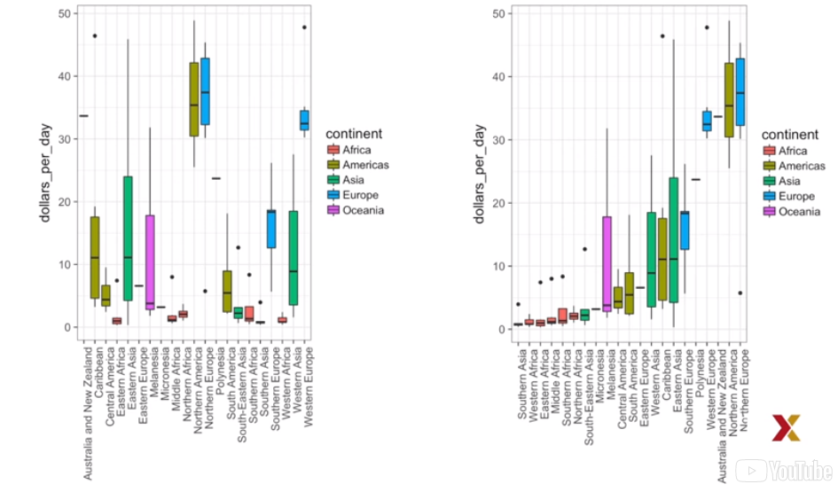

В первом мы просто заказываем в алфавитном порядке. Во втором мы заказываем медианное
значение каждой группы. Итак, увидели несколько примеров того, как упорядочение по
значимым объединениям сделать гораздо лучший графики.

### Show the Data

Сосредоточились на отображении отдельных величин по категориям. Теперь переместим
внимание на данные плоскости, сосредоточившись на сравнении групп. Чтобы мотивировать
этот принцип, вернемся к нашему официальному примеру, описывающему высоты внеземного,
ET.

На этот раз предположим, что ET заинтересована в различии высот между мужчинами и
женщинами. Обычно наблюдаемый график, используемый для сравнения между группами,
популяризированный программным обеспечением, таким как Microsoft Excel, показывает
среднюю и стандартную ошибку. Теперь имеем в виду, что стандартные ошибки, которые
мы определяем позже, не совпадают с стандартными отклонениями.

Вот как выглядит график.

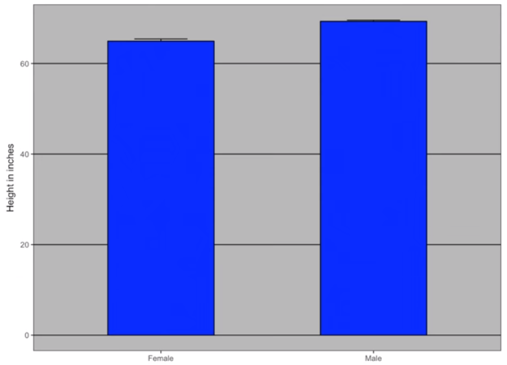

Среднее значение для каждой группы представлено верхней частью каждого бара, а антенна,
которую мы видим, расширяется, равна средней плюс две стандартные ошибки. Если ET
получит этот график, у него будет мало информации о том, чего ожидать, если он
встретит группу людей, мужчин и женщин.

Обратите внимание, что полосы переходят 0.

  * Означает ли это, что есть крошечные люди размером менее одного фута?
   
  * Все ли мужчины выше самой высокой женщины?
   
  * Есть ли диапазон высот?

ET не может ответить на эти вопросы, так как мы не предоставили практически никакой
информации о распределении высоты. Это возвращает нас к нашему принципу, как показать
данные.

Следующий простой код ggplot уже генерирует более информативный сюжет, чем график,
просто отображая все точки.

```{r}
heights %>% ggplot(aes(sex, height)) + geom_point()
```

Только эта маленькая строка кода показывает вам точки, высоты для женщин и высоту
для мужчин. Однако этот график имеет также ограничения. Так как не можем увидеть
все 216 и 708 точек, построенных для женщин и мужчин. И многие точки заложены друг
над другом, поэтому не знаем, сколько их есть.

Как описали, визуализация распределения гораздо более информативна. Но прежде чем
это сделать, укажем на два способа улучшения графика, показывающего все точки.

Первое - добавить джиттер. Джиттер добавляет небольшой случайный сдвиг в каждую точку.
В этом случае добавление горизонтального джиттера не изменяет интерпретацию, так как
высота точек не изменяется. Но мы минимизируем количество точек, которые попадают друг
на друга и, следовательно, лучше поймем, сколько точек и как распределяются данные.

Второе улучшение происходит от использования альфа-смешивания, делая точку несколько
прозрачной. Без альфа-смешивания, чем больше точек падает друг на друга, тем темнее
график попадает в этот регион, что также помогает нам понять, как распределяются точки.

Вот график с джиттером и альфа-смешением.

```{r}
heights %>% ggplot(aes(sex, height)) + geom_jitter(width = .25, alpha = .5)
```

Теперь, поскольку есть так много точек, более эффективно показывать распределение,
а не показывать отдельные точки.

### Ease Comparisons: Use Common Axes

Можем добавить точки, но хотим показать распределения.
Итак, начнем с создания гистограмм для каждой группы.

```{r echo=FALSE, message=FALSE, warning=FALSE}
heights %>% ggplot(aes(height, y = ..density..)) + geom_histogram(color = "black") + facet_grid(~ sex)
```

Однако из этого графика не сразу видно, что мужчины в среднем выше, чем женщины.
Мы должны внимательно посмотреть, что ось х имеет более высокий диапазон значений
в мужской гистограмме.

Это подводит нас к еще одному важному принципу, и для сравнения данных на графиках
необходимо поддерживать одинаковые оси. Сравнение становится легче, когда сохраняем
оси одинаковыми.

Теперь видим, что мужская гистограмма смещена вправо по сравнению с женской гистограммой.
Теперь есть еще один принцип, который нам нужно выполнить здесь, чтобы было еще проще
сравнивать, и выравнивать графики вертикально, чтобы видеть горизонтальные изменения, и горизонтально видеть вертикальные изменения.

В этих гистограммах визуальный сигнал, связанный с уменьшением или увеличением высоты,
смещается влево или вправо соответственно. Горизонтальное изменение, выравнивание по
графикам по вертикали, помогает нам видеть изменение при фиксировании осей. Это ясно
показывает, что высоты мужчин смещены вправо.

```{r echo=FALSE, message=FALSE, warning=FALSE}
heights %>% ggplot(aes(height, y = ..density..)) + geom_histogram(color = "black") + facet_grid(sex ~ .)
```

Если вместо гистограмм хотим получить более компактную сводку, предоставленную
графическими графиками, то мы выравниваем по горизонтали, так как по умолчанию
квадратные графики перемещаются вверх и вниз с изменениями высоты по вертикали.

```{r echo=FALSE, message=FALSE, warning=FALSE}
heights %>% ggplot(aes(sex, height)) +
  geom_boxplot() + 
  geom_jitter(width = .25, alpha = .5)
```

Вот два блока, построенных рядом друг с другом, горизонтально рядом друг с другом.
Можем оценить вертикальные изменения. В этом случае мы также добавляем все данные,
все точки, используя джиттер и альфа-смешивание.

### Consider Transformations

Другим важным принципом является рассмотрение преобразований.Мотивировали
использование логарифмического преобразования в случаях, когда изменения мультипликативны.
Размер популяции был примером, в котором использовали логарифмическое преобразование,
чтобы получить более информативный график. Комбинация неправильного использования
штриховых графиков при успешной трансформации log может быть особенно искажающей.
В качестве примера рассмотрим этот график, показывающий средний размер популяции для
каждого континента в 2015 году.

```{r}
data("gapminder")
data <- gapminder %>%
  filter(year == 2015, !is.na(population))

xy <-  reorder(data$continent, data$population, mean)

z <- attr(xy, "scores")

ggplot(data = NULL, aes(reorder(levels(xy),as.numeric(z[levels(xy)])), 
                        as.numeric(z[levels(xy)])/1000000)) +
  labs(x = "Continent", y = "Population in milions")+
  geom_bar(stat = "identity")
```

Из этого графика можно сделать вывод, что страны Азии намного более многочисленны,
чем другие континенты. Следуя принципу «show-the-data», быстро замечаем, что это
происходит из-за двух очень больших стран, которые являются Индией и Китаем.
Можем видеть здесь эти два пункта.

```{r}
data("gapminder")
gapminder %>%
  filter(year == 2015, !is.na(population)) %>%
  ggplot(aes(continent, population/1000000)) +
  labs(x = "Continent", y = "Population in milions") +
  geom_jitter(width = .3, alpha = .5)
```

Это те две страны. Здесь использование преобразования log обеспечивает гораздо более
информативный график. Сравниваем исходный график boxplot с использованием
преобразования логарифмической шкалы для оси y.

```{r}
gapminder %>%
  filter(year == 2015, !is.na(population)) %>%
  ggplot(aes(continent, population/1000000)) +
  labs(x = "Continent", y = "Population in milions") +
  scale_y_continuous(trans = "log10") +
  geom_boxplot() +
geom_jitter(width = .3, alpha = .5)
```

Обратите внимание, насколько более информативным является то, что boxplot диаграмма
находится над графиком. Фактически, видим, что в Африке средний размер популяции
выше, чем в Азии.

Другие преобразования, которые должны учитывать, - это логическое
преобразование - полезно, чтобы лучше видеть полные изменения в 
коэффициентах - и преобразование квадратного корня, полезное для данных подсчета.

### Ease Comparisons: Compared Visual Cues Should Be Adjacent

Введем еще один принцип. Это поможет облегчить сравнение.

Принцип заключается в том, что визуальные контрольные сигналы должны быть точными.
Сравнивая данные о доходах между 1970 и 2010 годами по регионам, составили данную
диаграмму.

```{r echo=FALSE}
gapminder %>%
  filter(year %in% c(1970, 2010) & !is.na(gdp)) %>%
  mutate(dollars_per_day = gdp/population/365) %>%
  ggplot(aes(continent, dollars_per_day)) +
  scale_y_continuous(trans = "log2") + 
  geom_boxplot(aes())
  

```

Разница в том, что здесь смотрим на континенты, а не на регионы. Но это не относится
к тому моменту, который пытаемся сделать. Обратите внимание, что для каждого
континента нужно сравнить распределение с 1970 по 2010 год.

Значение по умолчанию в ggplot - это упорядочение по алфавиту. Таким образом,
метки с 1970 года предстают перед метками с 2010 годом, что делает это сравнение
сложным.

```{r echo=FALSE}
gapminder %>%
  filter(year %in% c(1970, 2010) & !is.na(gdp)) %>%
  mutate(dollars_per_day = gdp/population/365) %>%
  ggplot(aes(continent, dollars_per_day)) +
  scale_y_continuous(trans = "log2") +
  geom_boxplot(aes(shape = factor(year)))
```

Знайте, насколько проще сделать сравнение, когда блоки блоков, которые хотим сравнить, находятся рядом друг с другом.

```{r echo=FALSE}
gapminder %>%
  filter(year %in% c(1970, 2010) & !is.na(gdp)) %>%
  mutate(dollars_per_day = gdp/population/365) %>%
  ggplot(aes(continent, dollars_per_day)) +
  scale_y_continuous(trans = "log2") +
  geom_boxplot(aes(fill = factor(year)))
```

Здесь мы переупорядочили их, чтобы сделать именно это.
Сравнение становится еще проще, если мы используем цвет, чтобы отличать 1970-2010.

Использование цвета - еще один способ облегчить сравнение. Когда выбираете цвета, имейте в виду, что около 10% населения окрашено вслепую. К сожалению, цвета по умолчанию,
используемые в ggplot, не являются оптимальными для этой группы. Однако ggplot упрощает
изменение цветовой палитры, используемой на графиках.

```{r}
color_bind_friendly_cols <- c("#999999", "#E69F00", "#5684E9", "#009E73", "#F0E442",
                              "#007282", "#D55E00", "#CC79A7")
p1 <- data.frame(x = 1:8, y = 1:8, col = as.character(1:8)) %>% 
  ggplot(aes(x, y, color = col)) +
  geom_point(size = 5)

p1 + scale_color_manual(values = color_bind_friendly_cols)
```

Вот пример того, как можем использовать цветную слепую дружественную палитру, используя ggplot. Мы можем видеть, что добавив несколько слоев и выбрав нужные цвета, можем,
по сути, использовать любые цвета.

### Slope Charts

В каждом отдельном случае, в котором рассмотрели взаимосвязь между двумя переменными,
общими убийствами по сравнению с размером популяции, ожидаемой продолжительностью жизни
по сравнению с показателями рождаемости и детской смертностью по сравнению с доходом,
мы использовали scatterplots.

Это график, который обычно рекомендуется. Одно исключение, когда другой тип графика
может быть более информативным, - это когда сравниваются переменные того же типа,
но в разные моменты времени и относительно небольшое количество сравнений.

Например, сравнение ожидаемой продолжительности жизни в период с 2010 по 2015 год.
В этом случае можем рассмотреть график наклона. Геометрии диаграмм наклона в ggplot2
нет, но можем построить один, используя geom_lines. Нам нужно сделать некоторые
манипуляции, чтобы добавить ярлыки и некоторые другие изменения.

Код выглядит примерно так.

```{r}
west <- c("Western Europe", "Northern Europe", "Southern Europe", "Northern America",
          "Australia and New Zealand")
dat <- gapminder %>% 
  filter(year%in% c(2010, 2015) & region %in% west &
           !is.na(life_expectancy) & population > 10^7)
dat %>% 
  mutate(location = ifelse(year == 2010, 1, 2),
         location = ifelse(year == 2015 & country%in%c("United Kingdom", "Portugal"),
                           location + 0.22, location),
         hjust = ifelse(year == 2010, 1, 0)) %>%
  mutate(year = as.factor(year)) %>%
  ggplot(aes(year, life_expectancy, group = country)) +
  geom_line(aes(color = country), show.legend = FALSE) +
  geom_text(aes(x = location, label = country, hjust = hjust),
            show.legend = FALSE) +
  xlab("") + ylab("Life Expectancy")
```

Эта часть кода создает следующую диаграмму наклона. Преимущество диаграммы наклона
состоит в том, что он позволяет нам быстро получить представление об изменениях,
основанных на наклоне линий. Обратите внимание, что используем угол как визуальный
сигнал, но у нас также есть позиция для определения точных значений.

Сравнение улучшения немного сложнее, когда используем диаграмму рассеяния. Обратите 
внимание, что в диаграмме рассеяния следовали принципу, использующему общие оси,
поскольку сравниваем значения до и после.

Теперь обратим внимание, что когда у нас много точек, заряд наклона перестает быть
полезным, потому что он становится слишком загроможденным, и в этом случае будем
использовать диаграмму рассеяния.

Наконец, мы собираемся описать график Бланда-Альтмана.

```{r}
p <- data.frame(country = dat$country[dat$year == 2010],
                 year_2010 = dat$life_expectancy[dat$year == 2010],
                 year_2015 = dat$life_expectancy[dat$year == 2015])

p %>%
  ggplot(aes(year_2010, year_2015, group = country)) +
  geom_point(aes()) +
  geom_text_repel(aes(label = country),
            show.legend = FALSE) +
  geom_abline(intercept = 0, slope = 1, linetype = "dashed") +
  xlab("2010") + ylab("2015")
```

Поскольку нам интересны различия, имеет смысл посвятить одну из наших осей различиям.
График Бланда-Альтмана, также известный как двухзначный средний сюжет, а также график МА, показывает разницу по сравнению со средним.
Вот пример.

```{r}
p %>%
  ggplot(aes((year_2010 + year_2015) / 2,
             year_2015 - year_2010,
             group = country)) +
  geom_point(aes()) +
  geom_text_repel(aes(label = country),
            show.legend = FALSE) +
  geom_abline(intercept = 0, slope = 1, linetype = "dashed") +
  xlab("Average of 2010 and 2015") + 
  ylab("Difference between 2015 and 2010")
```

Здесь мы быстро видим, какие страны улучшили большинство, поскольку они представлены
на оси Y. Мы также получаем представление об общем значении от оси x.

### Encoding a Third Variable 

```{r}
print("Если в следующей лекции не раскрывается эта тема, решить самому!")
```

Ранее мы показали диаграмму рассеяния, показывающую взаимосвязь между коэффициентами выживаемости младенцев и средним доходом.
Вот версия этого графика, где мы кодируем еще три переменные, членство в ОПЕК, регион и размер популяции.
Обратите внимание, что мы кодируем категориальные переменные с цветовым оттенком и формой.
Эти формы можно контролировать с помощью аргумента формы.
Вот формы, доступные для использования в R. Обратите внимание, что за последние пять цвет входит внутрь.
Для непрерывных переменных мы можем использовать цвет, интенсивность или размер.
В следующем видео мы собираемся показать пример, демонстрирующий, как это сделать.

### Case Study: Vaccines

Вакцины помогли спасти миллионы жизней. В XIX веке, прежде чем вакцинация была
обеспечена, смертность от инфекционных заболеваний, таких как оспа и полиомиелит,
была распространена. Однако сегодня, несмотря на все научные доказательства их
важности, программы вакцинации стали несколько противоречивыми.

Противоречие началось с публикации, опубликованной в 1988 году, и во главе с Эндрю
Уэйкфилдом утверждалось, что существует связь между введением вакцины против кори,
эпидемического паротита и краснухи MMR, а также появлением аутизма и заболевания
кишечника.

Несмотря на множество научных доказательств, противоречащих этому нахождению, сообщения
в сенсационных СМИ и страх, связанные с теориями заговора, заставляют часть общественности
полагать, что вакцины были вредными. Некоторые родители даже прекратили вакцинацию своих
детей.

Эта опасная практика может быть потенциально катастрофической, учитывая, что Центр по
контролю за заболеваниями, CDC, считает, что вакцинация предотвратит более 21 миллиона
госпитализаций и 732 000 смертей среди детей, родившихся за последние 20 лет.

С тех пор документ 1988 года был отозван, и Эндрю Уэйкфилд был в конечном итоге удален
из британского медицинского регистра с заявлением и выявление преднамеренной фальсификации
в исследовании, опубликованном в The Lancet, и поэтому было запрещено заниматься медициной
в Великобритании.

Однако заблуждения сохраняются, частично, благодаря самопровозглашенным активистам,
которые продолжают развеять дезинформацию о вакцинах. Эффективная коммуникация
данных - сильное противоядие от дезинформации и страха.

Ранее был показан пример, предоставленный Wall Street Journal, в котором приведены данные
о влиянии вакцин на борьбу с инфекционными заболеваниями. Здесь мы реконструируем этот
пример.

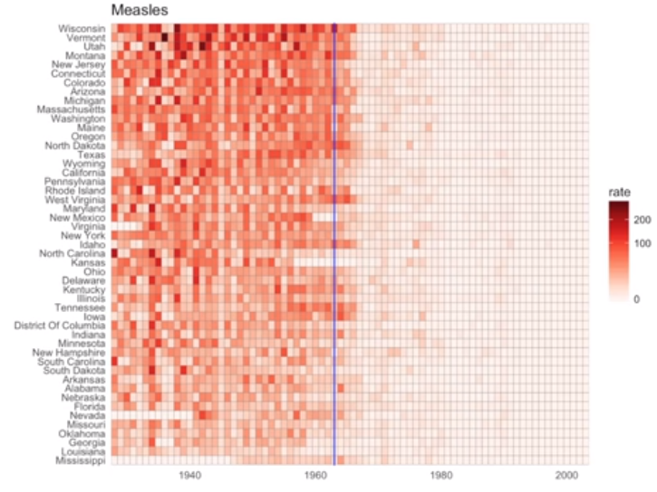

Данные, используемые на этих участках, были собраны, организованы и распределены
проектом Tycho. Они включают еженедельные данные о подсчетах по 7 заболеваниям
с 1928 по 2011 год из всех 50 штатов.

Подключим годовые итоги в пакете dslabs.

```{r}
data(us_contagious_diseases)
str(us_contagious_diseases)
```

Для гарафика, который мы собираемся сделать, мы создаем временный объект с именем dat,
который хранит все данные о кори. Он включает в себя 100 000 коэффициентов, состояния
заказов по средней величине болезни и удаляет Аляску и Гавайи, поскольку они стали
частью штатов в конце 50-х годов.

```{r}
the_disease <- "Measles"
dat <- us_contagious_diseases %>%
  filter(!state%in%c("Hawaii", "Alaska") & disease == the_disease) %>%
  mutate(rate = count / population * 10000) %>%
  mutate(state = reorder(state, rate))
```

Теперь можем легко определить уровень заболеваемости за год. Вот данные кори для
Калифорнии.

```{r}
dat %>%
  filter(state == "California") %>%
  ggplot(aes(year, rate)) +
  geom_line() +
  ylab("Cases per 10000") +
  geom_vline(xintercept = 1963, col = "blue")
```

Добавляем вертикальную линию в 1963 году, когда была введена вакцина.

Теперь можем показать данные для всех состояний в одном графике?

У нас есть три переменные для отображения, год, состояние и скорость. В диаграмме
Wall Street Journal они используют ось x для года, ось y для состояния, а цветовой
оттенок представляет собой показатели.

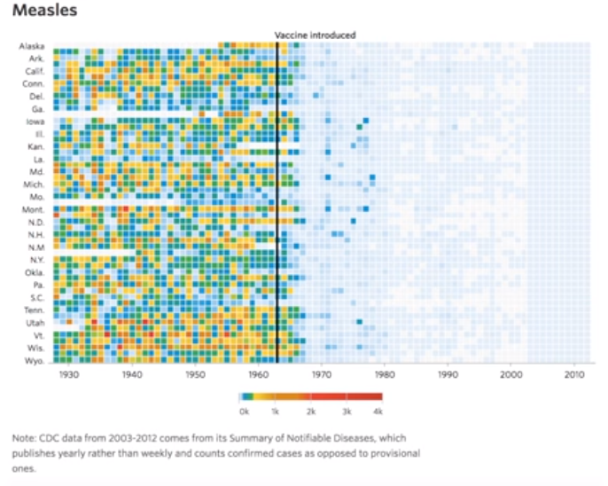

Используем цвет для представления непрерывной переменной. Тем не менее, цветовая гамма,
которую они используют, от желтого к синему до зеленого, от оранжевого до красного,
может быть улучшена.

При выборе цветов для количественной оценки числовой переменной выбираем между двумя
вариантами, последовательными и расходящимися. Последовательные палитры подходят для
данных, которые идут от высоких к низким. Высокие значения четко отличаются от низких
значений.

Вот некоторые примеры, предлагаемые пакетом R color Brewer.

```{r}
library("RColorBrewer")
display.brewer.all(type = "seq")
```

С другой стороны, расходящиеся цвета используются для представления значений, которые
граничат с центром.

Мы делаем упор на обоих концах диапазона данных, выше центра и ниже центра.
Примером того, когда мы будем использовать расходящийся шаблон, было бы, если бы
показывали высоты и стандартные отклонения от среднего.

Вот пример расходящихся шаблонов, доступных от R Color Brewer.

```{r}
library("RColorBrewer")
display.brewer.all(type = "div")
```

В нашем примере хотим использовать последовательную палитру, поскольку нет значимого
центра, только низкие и высокие уровни. Используем геометрию geom_tile для разбивки
области с цветами, представляющими заболеваемость. Используем преобразование квадратного 
корня, чтобы избежать того, чтобы на графике доминировали действительно высокие показатели.

Вот код, который создает очень хороший и впечатляющий график.

```{r}
dat %>%
  ggplot(aes(year, state, fill = rate)) +
  geom_tile(color = "grey50") +
  scale_x_continuous(expand = c(0,0)) +
  scale_fill_gradientn(colors = brewer.pal(9, "Reds"), trans = "sqrt") +
  geom_vline(xintercept = 1963, col = "blue") +
  theme_minimal() +
  theme(panel.grid = element_blank()) +
  ggtitle(the_disease) +
  xlab("") +
  ylab("")
```

Этот график делает очень яркий аргумент в пользу вклада вакцин. Тем не менее, одним из
ограничений этого графика является то, что он использует цвет для представления
количества, что мы ранее объяснили, что немного сложнее узнать, насколько он высок.

Если хотим потерять информацию о данных, можем сделать версию графика, показывающую
значения с позицией. Также можем показать среднее значение для США, которое вычисляем
следующим образом.

```{r}
avg <- us_contagious_diseases %>%
  filter(disease == the_disease) %>%
  group_by(year) %>%
  summarize(us_rate = sum(count, na.rm = TRUE)/sum(population, na.rm = TRUE) * 10000)
```

Теперь, чтобы сделать график, просто используем geom_line геометрии. Cобираемся сделать
все состояния одного цвета. Это потому, что сложнее выбрать 50 различных цветов.
Однако график очень впечатляющий.

```{r}
dat %>%
  ggplot(aes(year, rate)) +
  geom_line(color = "grey50", aes(fill = state)) +
  scale_x_continuous(expand = c(0,0)) +
  scale_y_continuous(trans = "sqrt") +
  geom_vline(xintercept = 1963, col = "blue") +
  theme_minimal() +
  theme(panel.grid = element_blank()) +
  ggtitle(the_disease) +
  xlab("") +
  ylab("")+
  geom_line(data = avg, aes(year, us_rate)) +
  geom_text(data = avg, aes(1950, y = 50, label = "US average"), check_overlap = TRUE)
```

Он очень четко показывает, как после введения вакцины уровни пошли вниз по всем штатам.
Он показывает ту же информацию, что и наш предыдущий график, но теперь действительно
можем видеть, какие значения.

### Avoid Pseudo and Gratuitous 3D Plots

Избегайте псевдо трехмерных графиков. Показанный здесь рисунок был взят из научной
литературы.

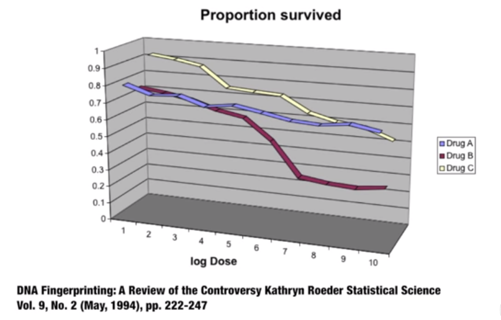

Он показывает три переменные, дозу, тип лекарственного средства и выживаемость.
Хотя, когда вы смотрите на график, вы почти всегда смотрите на экран или страницу
книги, которые являются плоскими и двумерными, этот график пытается имитировать
трехмерность и присваивает измерение каждой переменной.

Люди не умеют видеть в трех измерениях. Подумайте о том, как трудно это сделать
в параллельном парке. И наше ограничение еще хуже, когда оно псевдо-трехмерное,
как это делается, когда кладем его на страницу или на веб-страницу. Чтобы увидеть это, попытайтесь определить значение переменной выживания на графике.

Можете ли вы сказать, когда фиолетовая лента пересекает красный?

Это пример, в котором легко использовать цвет для представления категориальной
переменной. Мы можем сделать такой график. 

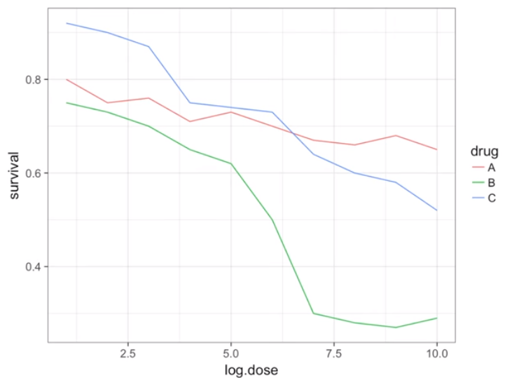

Этот график показывает, что использование цвета более чем достаточно, чтобы отличить три строки.

Псевдо 3D несколько используется полностью безвозмездно. Графики создаются для просмотра
3D, даже если третье измерение не представляет никакого количества. Это лишь добавляет
путаницы и затрудняет передачу вашего сообщения.

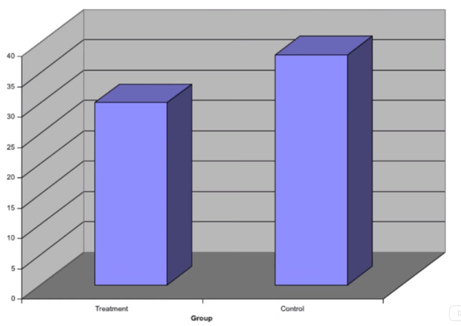

Это трехмерный bar plot. В третьем измерении ничего не добавляется, только путаница. Поэтому, вообще, нужно избегать псевдо 3D-графиков и даже избегать ничем не вызваных
3D-графиков.

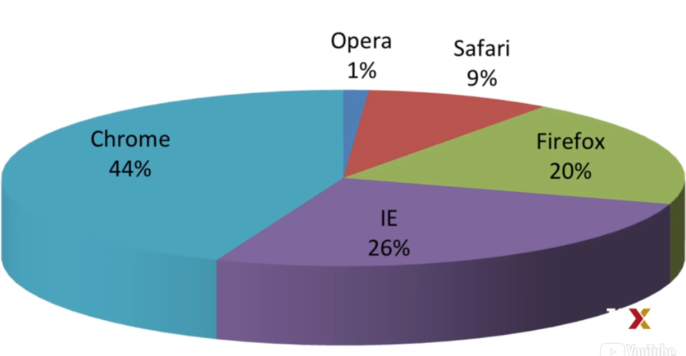

### Avoid Too Many Significant Digits

По умолчанию статистическое программное обеспечение, такое как R, возвращает много
значащих цифр. Принцип, который мы собираемся обсудить, относится к таблицам,
а не к графикам, и нужно избегать слишком большого количества статистических цифр.

Поведение по умолчанию в R означает показать семь значащих цифр. Так много цифр часто
не добавляют никакой информации, и визуальный беспорядок затрудняет понимание
потребителем вашей таблицы сообщения.

Например, здесь на 10 000 заболеваемости в Калифорнии в течение пяти десятилетий.

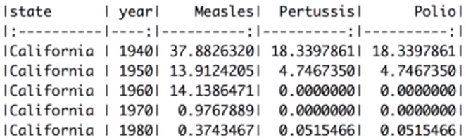

Мы сообщаем о позициях до 0,00001 случаев на 10 000, что очень малое значение в
контексте изменений, которые происходят в течение дат. В этом случае две значимые
цифры более чем достаточно и указывают, что ставки снижаются.

Полезные функции в R для изменения количества значимых цифр или округлых чисел
являются signif и round Можем определить количество значимых цифр для
использования в глобальном масштабе, установив options(digits=n)

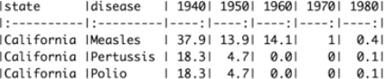

Другим принципом, связанным с отображением таблиц, является сравнение значений места
по столбцам, а не по строкам. Вот как выглядела бы таблица, если бы поместили числа,
сравниваемые по горизонтали. Сделать сравнение немного сложнее.