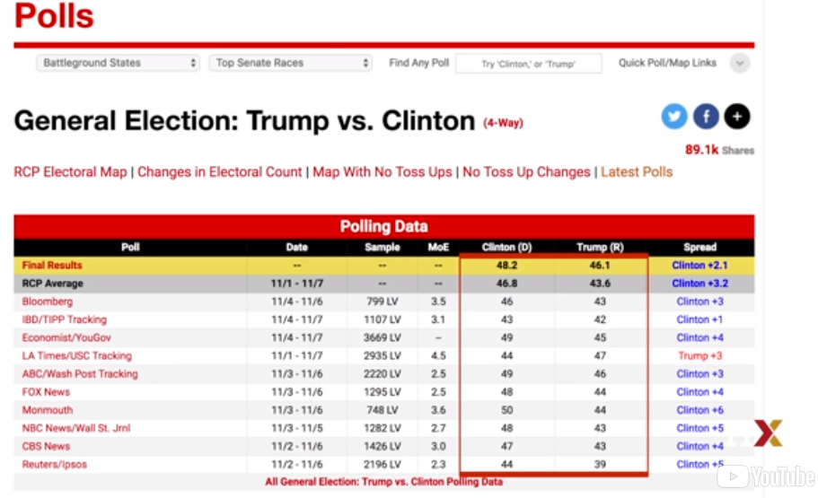

### Introduction to interface

Опрос общественного мнения проводится с 19 века. Общая цель их состоит в том,
чтобы описать мнения определенного населения по заданному набору тем. В последнее
время эти опросы широко распространены во время президентских выборов. Опросы
полезны, когда спрашивать всех в населении логически невозможно. Общая стратегия
заключается в том, чтобы спросить меньшую группу, которая обычно выбирается наугад,
а затем выводит мнение всего населения из мнений меньшей группы.

Статистическая теория используется для обоснования процесса. Эта теория называется
умозаключением и является основной темой этого модуля. Возможно, наиболее известными
опросами общественного мнения являются те, которые проводятся для определения того,
какой кандидат предпочитает избиратели на выбранных выборах.

Политические стратеги широко используют опросы, чтобы определить, например, как
инвестировать ресурсы. Например, они могут захотеть узнать, какое географическое
положение сосредоточено на усилиях «выйти на голосование». Выборы - особенно
интересный случай опросов общественного мнения, поскольку в день выборов выявлено
фактическое мнение всего населения. Разумеется, для фактических выборов стоит
миллионы долларов, что делает опрос экономически эффективной стратегией для тех,
кто хочет предсказать выборы.

Хотя обычно результаты опросов, проводимых политическими стратегами, остаются частными,
аналогичные опросы проводятся новостными организациями, потому что результаты, как
правило, представляют интерес для широкой общественности, и их часто публикуют.
В конечном итоге мы рассмотрим эти данные.

RealClearPolitics - это пример агрегатора новостей, который организует и публикует
результаты опроса. Например, здесь приведены примеры опросов, в которых сообщается о
всенародном голосовании на президентских выборах 2016 года. Хотя в Соединенных Штатах
народное голосование не определяет результат выборов, мы используем его здесь в качестве
иллюстративного и простого примера того, как работают хорошие опросы. Прогнозирование
выборов является более сложным процессом, поскольку оно предполагает объединение
результатов из 50 штатов и DC.

Отлично.

Давайте сделаем некоторые замечания о таблице, которую мы только что показали.
Во-первых, обратите внимание, что различные опросы, проведенные за несколько дней до
выборов, сообщают о разном распространении, предполагаемая разница между поддержкой
двух кандидатов. Обратите также внимание на то, что сообщаемые спреды парят вокруг
того, что в конечном итоге стало фактическим результатом. Клинтон выиграл всенародное
голосование на 2,1%. Мы также видим столбец под названием «MOE», который обозначает
запас ошибки.

В этом модуле покажем, как методы вероятности, которые изучили в предыдущем модуле,
можно применять для разработки статистических подходов, которые делают опросы
эффективным инструментом.

Изучим статистические концепции, необходимые для определения оценок и полей ошибок,
и покажем, как можем использовать их для прогнозирования окончательных результатов
относительно хорошо, а также для оценки точности нашего прогноза.
Как только узнаем об этом, мы сможем понять две концепции, которые являются повсеместными
в науке о данных, доверительных интервалах и значениях p. Начнем с того, что связывает
теорию вероятностей с задачей использования опросов, чтобы узнать о населении.