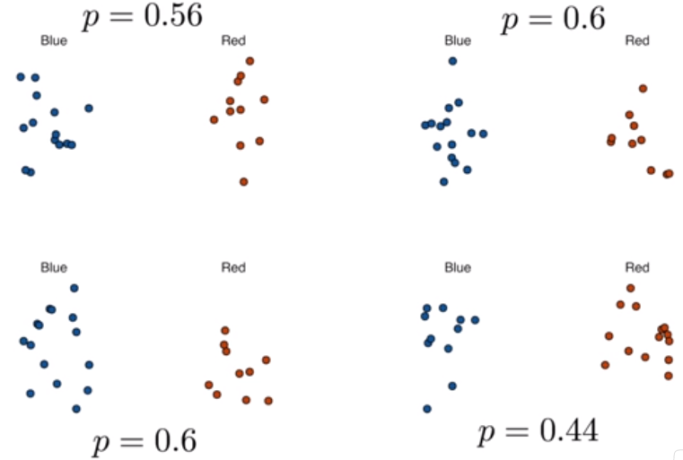

### Sampling Model Parameters and Estimates

Чтобы помочь нам понять взаимосвязь между опросами и теорией вероятности,
которые мы узнали, давайте построим сценарий, с которым мы можем работать
вместе, и это похоже на тот, с которым сталкиваются участники опроса.
Вместо избирателей будем использовать урну. И поскольку опросники конкурируют
с другими опросниками за внимание средств массовой информации, мы будем подражать
тому, что наша конкуренция получит приз в размере 25 долларов США.

Задача состоит в том, чтобы угадать распространение между пропорцией синих и красных
шаров в этой урне. Прежде чем делать прогноз, можно взять образец с заменой из урны.
Чтобы подражать факту, что результаты опроса стоят дорого, это будет стоить
вам 0,10 доллара США за каждый образец. Так что, если ваш размер выборки равен 250,
и вы выиграете, вы будете не в убытке, так как вам придется заплатить мне 25 долларов,
чтобы забрать свои 25 долларов. Ваш вход в соревнование может быть интервалом.
Если промежуток, который вы отправляете, содержит истинную пропорцию, вы получаете
половину того, что вы заплатили, и переходите ко второму этапу конкурса.

На втором этапе конкурса в качестве победителя выбирается запись с наименьшим интервалом.
Пакет dslabs включает функцию, которая показывает случайную жеребьевку из урны что мы
только что видели.

Вот код, который вы можете написать, чтобы увидеть образец.

```{r}
library(tidyselect)
library(ggplot2)
library(dslabs)
ds_theme_set()
take_poll(25)
```

И вот образец с 25 шариками.
Хорошо, теперь, когда вы знаете правила, подумайте о том, как построить свой интервал.
Сколько бусин вы бы взяли и так далее. Обратите внимание, что мы только что описали
простую модель выборки для опросов общественного мнения. Бусины внутри урны представляют
людей, которые будут голосовать в день выборов. Те, кто проголосует за республиканцев,
представлены красными бусами и демократами с синими бусами.

Для простоты предположим, что других цветов нет, есть только две стороны.
Мы хотим предсказать долю голубых бусин в урне. Назовем эту величину p, которая, в свою
очередь, сообщит нам долю красных шариков, 1 - p и спред p - (1 минус p), что
упростит до 2p - 1.

В статистических учебниках бусины в урне называются населением. Доля голубых бусин в
популяции p называется параметром. 25 шариков, которые мы видели на более раннем участке
после того, как мы пробовали, это называется образцом.

Задача статистического вывода - предсказать параметр p, используя наблюдаемые данные в
выборке. Теперь, можем ли мы сделать это только с 25 наблюдениями, которые мы вам
показали? Ну, они, конечно, информативны.

Например, учитывая, что мы видим 13 красных и 12 синих, маловероятно, что p больше 0,9
или меньше 0,1. Потому что, если бы это было так, было бы невозможно увидеть 13 красных
и 12 синих. Но готовы ли мы с уверенностью предсказать, что есть больше красных бусин, чем синих?

Хорошо, что мы хотим сделать, это построить оценку p, используя только информацию,
которую мы наблюдаем. Оценку можно рассматривать как сводку наблюдаемых данных, которые,
по нашему мнению, являются информативными по интересующему параметру. Кажется интуитивно понятным, что доля голубых шариков в выборке, которая в данном случае равна 0,48, должна быть как минимум связана с фактической пропорцией p.

Но можем ли мы просто предсказать p равным 0.48?

Во-первых, обратите внимание, что доля выборки является случайной величиной. Если мы
запустим команду take_poll (25), скажем четыре раза, мы получим четыре разных ответа.

```{r eval=FALSE, message=FALSE, warning=FALSE}
take_poll(25) 
take_poll(25) 
take_poll(25) 
take_poll(25) 
```



Каждый раз, когда образец отличается, и пропорция образца различна. Соотношение выборок
является случайной величиной. Обратите внимание, что в четырех случайных выборках,
которые мы показываем, доля выборки колеблется от 0,44 до 0,6.

Описывая распределение этой случайной величины, мы сможем получить представление о том,
фнасколько хороша эта оценка и как мы можем улучшить ее.

### The Sample Average

Проведение опроса общественного мнения моделируется как получение случайной выборки
из урны. Мы предлагаем использовать долю голубых шариков в нашем образце в качестве
оценки параметра р.

Как только мы получим эту оценку, мы можем легко сообщить оценку спреда, 2p - 1.
Но для простоты мы проиллюстрируем концепцию статистического вывода для оценки р.
Мы будем использовать наши знания о вероятности для защиты нашего использования
доли выборки и количественно определить, насколько близко мы думаем, что это из
доли населения p.

Начнем с определения случайной величины X. $X = 1$, если мы достанем
синюю бусину случайным образом, а 0 - красным. Это означает, что мы предполагаем, что
население, бусы в урне, является списком 0s и 1s. Если мы выберем N шариков, то среднее
значение жеребьевки $X_1, X_2, .., X_N$ эквивалентно пропорции голубых шариков в нашем
образце. Это связано с тем, что добавление Xs эквивалентно подсчету синих шариков и
деление на общее число N превращает это в пропорцию.

$$
\bar{X} = {{X_1 + X_2 + ... + X_n} \over N}.
$$

Мы используем символ $\bar{X}$ (X-bar) для представления этого среднего значения.
В общем, в  статистических учебниках бар поверх символа означает среднее. Теория,
которую мы только что узнали о сумме жеребьевки, становится полезной, потому что
мы знаем распределение суммы N раз $\bar{X}$. Мы знаем распределение среднего X-бара, 
поскольку N - не случайная константа.

$$
N\bar{X} = {{N*(X_1 + X_2 + ... + X_n)} \over N} = (X_1 + X_2 + ... + X_n).
$$

Для простоты предположим, что розыгрыш независимы. После того, как мы увидим каждый
образец шарика, мы вернем его в урну. Это образец с заменой. В этом случае, что мы
знаем о распределении суммы жеребьевки?

Во-первых, мы знаем, что ожидаемое значение суммы выигрышей равно N раз в среднем
значений в урне. Мы знаем, что среднее значение 0s и 1s в урне должно быть долей p,
которую мы хотим оценить. Здесь мы сталкиваемся с существенным отличием от того,
что мы сделали в модуле вероятности. Мы не знаем, что находится в урне. Мы знаем,
что есть синие и красные бусины, но мы не знаем, сколько их. Это то, что мы пытаемся
выяснить. Мы пытаемся оценить p. Так же, как мы используем переменные для определения
неизвестных в системах уравнений, в статистическом выводе мы определяем параметры для
определения неизвестных частей наших моделей. В модели урны, которую мы используем для 
имитации опроса общественного мнения, мы не знаем доли голубых бусин в урне.

Мы определяем параметр p для представления этой величины. Мы оценим этот параметр.
Обратите внимание, что представленные здесь идеи, как мы оцениваем параметры
и даем представление о том, насколько хороши эти оценки, экстраполируются на многие
задачи в области науки.

Например, мы можем спросить, какова разница в улучшении здоровья между пациентами, 
получающими лечение, и контрольной группой? Мы можем спросить, каковы последствия
курения для здоровья для населения? Каковы различия в расовых группах смертельных
расстрелов со стороны полиции? Какова скорость изменения ожидаемой продолжительности
жизни в США за последние 10 лет? Все эти вопросы могут быть сформулированы как задача
оценки параметра из выборки.

### Polling versus Forecasting

Прежде чем мы продолжим, давайте сделаем важное разъяснение, связанное с практической
проблемой прогнозирования выборов. Если опрос проводится за 4 месяца до выборов, он
оценивает p на тот момент, а не на день выборов. Но, обратите внимание, что p для
предвыборной ночи может отличаться, поскольку мнения людей колеблются вразное временя.
Опросы, проведенные накануне выборов, как правило, являются самыми точными, поскольку 
мнения не меняются так быстро за пару дней.

Тем не менее, прогнозисты пытаются создать инструменты, которые моделируют, как мнения
меняются во времени и пытаются предсказать результат дня выборов, принимая во внимание
тот факт, что мнения меняются. Мы опишем некоторые подходы для этого.

### Properties of Our Estimate

Чтобы понять, насколько хороша наша оценка, мы опишем статистические свойства только
что определенной случайной величины - доли выборки. Заметим, что если умножить на N,
N раз X-bar - это сумма независимой жеребьевки, поэтому применяются правила, которые мы
рассмотрели в модуле вероятности.

$$
N\bar{X} = {{N*(X_1 + X_2 + ... + X_n)} \over N} = (X_1 + X_2 + ... + X_n).
$$

Используя то, что мы узнали, ожидаемое значение $E(N\bar{X}) = N * p$. Итак, деление
на неслучайную константу N дает нам, что ожидаемое значение среднего X-бара равно p.

$$
E(\bar{X}) = p
$$

Мы также можем использовать то, что мы узнали, для определения стандартной
ошибки. Мы знаем, что стандартная ошибка суммы является квадратным корнем
из N раз стандартного отклонения значений в урне. Можно ли вычислить стандартную
ошибку урны?

Мы выучили формулу, которая говорит нам, что она равна:

$$
(1 - 0)\sqrt{p(1 - p)} = \sqrt{p(1 - p)}
$$

ФОРМУЛА!!!
Поскольку мы делим на сумму N, мы приходим к следующей формуле для стандартной ошибки
среднего. Стандартная ошибка:

$$
SE(\bar{X}) = \sqrt{p(1 - p) / N}
$$

Этот результат показывает силу опросов. Ожидаемое значение доли образца, $\bar{X}$,
представляет собой представляющий интересный параметр, p. И мы можем сделать стандартную
ошибку как можно меньше, увеличив размер выборки N. Закон больших чисел говорит нам,
что при достаточно большом опросе наша оценка сходится к p. Если мы проведем достаточно
большой опрос, чтобы сделать нашу стандартную ошибку, скажем, около 0,01, мы будем 
совершенно уверены в том, кто победит.

Но насколько большой pool должен быть для такой маленькой стандартной ошибки? Одна из
проблем заключается в том, что мы не знаем p, поэтому мы не можем фактически вычислить
стандартную ошибку.

Для иллюстративных целей предположим, что p равно 0,51 и составить график стандартной
ошибки в сравнении с размером выборки N.


Можем видеть, что, очевидно, оно падает. Из графика также видим, что нам понадобится
опрос более 10 000 человек, чтобы получить стандартную ошибку как можно ниже. Мы редко
видим опросы такого размера из-за затрат. Позже мы объясним другие причины. Из таблицы
RealClearPolitics, которую мы видели ранее, мы узнали, что размеры выборки в опросах
общественного мнения варьируются от 500 до 3500.

Если размер выборки равен 1000, если установить p = 0,51, стандартная ошибка (SE)
составляет около 0,15 или 1,5 процентных пункта. Поэтому даже при больших опросах,
для закрытых выборов, $\bar{X}$ может сбить нас с пути, если мы не поймем, что это
случайная величина. Но мы можем сказать больше о том, как близко мы можем подойти
к параметру p. Сделаем это в чуть позже.
