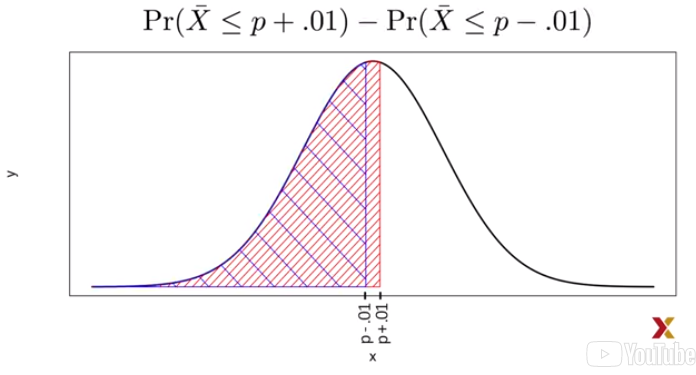
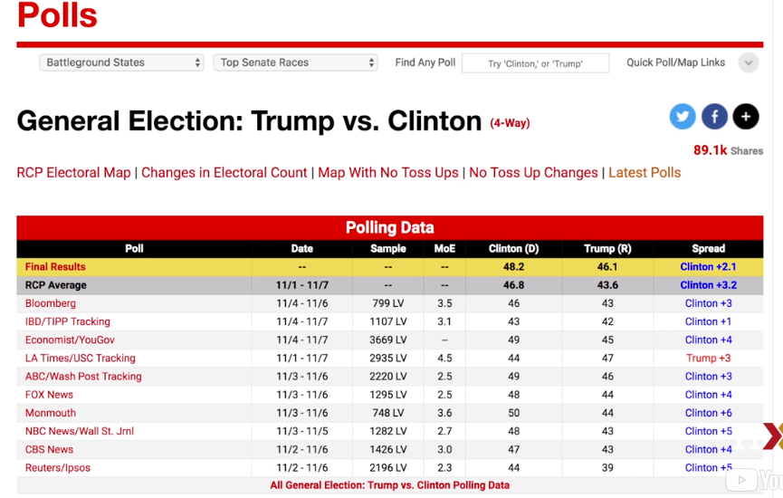

### The Central Limit Theorem in Practice

```{r message=FALSE, warning=FALSE, include=FALSE, paged.print=FALSE}
library(dplyr)
library(ggplot2)
library(gridExtra)
```
Центральная предельная теорема говорит нам, что функция распределения для суммы ничьих
приблизительно нормальна. Мы также узнали, что при делении нормально распределенной
случайной величины на неслучайную константу результирующая случайная величина также
нормально распределена.

$$
X ~ N(\mu, \sigma), 
{X\over a} \sim N({\mu \over a}, {\sigma \over a})
$$

Это означает, что распределение $\bar{X}$ является приблизительно нормальным.
Таким образом, в итоге, $\bar{X}$ имеет приблизительно нормальное 
распределение. И в предыдущей теме мы определили, что ожидаемое значение p, а
стандартная ошибка $\bar X: \sqrt{p(1-p)/N}$.

Итак, как это нам поможет?

Давайте зададим примерный вопрос.

Предположим, мы хотим знать, какова вероятность того, что мы находимся в пределах
одного процентного пункта от p. Что мы сделали очень, очень хорошую оценку? Таким
образом, мы в основном спрашиваем, какова вероятность того, что расстояние между
$\bar{X}$ и p, абсолютное значение $Pr(\mid \bar{X} - p \mid \leq 0,01)$. Мы
можем использовать то, что мы научились видеть, это все равно что спросить, какова вероятность того, что Pr($\bar{X} \leq p + 0.01) - Pr(\bar{X} \leq p - 0.01).$



Теперь мы можем ответить вопрос? Можем вычислить эту вероятность?

Обратите внимание, что можем использовать математический трюк, который мы узнали в
предыдущем модуле.

Что это был за трюк?

$$
Pr({\bar X - E(\bar X) \over SE(\bar X)}\leq {(p + 0.01) - E(\bar X) \over SE(\bar X)}) - Pr({\bar X - E(\bar X) \over SE(\bar X)}\leq {(p - 0.01) - E(\bar X) \over SE(\bar X)}) 
$$

Мы вычитаем ожидаемое значение и делим на стандартную ошибку с обеих сторон уравнения.
Это дает нам стандартную нормальную переменную, которую мы называем заглавной Z, с левой 
стороны.

$$
Pr(Z \leq {(p + 0.01) - E(\bar X) \over SE(\bar X)}) - Pr(Z \leq {(p - 0.01) - E(\bar X) \over SE(\bar X)}) 
$$

Поскольку $E(\bar X) = p$ значение, а $SE(\bar{X}) = \sqrt{p(1 - p)/N}$, мы получаем,
что вероятность, которую мы только что вычисляли, эквивалентна вероятности Z,

$$
Pr(Z \leq 0.01/\sqrt{p(1 - p)/N}) - Pr(Z \leq -0.01 /\sqrt{p(1 - p)/N}).
$$

Хорошо, теперь можем вычислить эту вероятность?

Еще нет.

Наша проблема в том, что мы не знаем p.
Таким образом, мы не можем вычислить $SE(\bar X)$, используя только данные.
Но оказывается, что CLT (Central limit theorem) все еще работает, если мы
используем оценку стандартной ошибки, которая вместо p использует $\bar X$
на своем месте.

Мы говорим, что это плагин оценки. Мы называем это оценочный плагин.

Поэтому наша оценка $\hat{SE}(\bar X) = \sqrt{\bar X(1 - \bar X)/N}$, обратите
внимание, что мы заменили p на $\bar X$. В математической формуле, которую мы
показываем, вы можете увидеть шляпу поверх $\hat{SE}$. В учебниках по статистике
мы используем такую маленькую шляпу для обозначения **оценок**. Это оценка
стандартной ошибки, а не фактической стандартной ошибки. Но, как мы уже говорили,
Центральная предельная теорема все еще работает.

Обратите внимание, важно, что эта оценка действительно может быть построена с
использованием наблюдаемых данных.

Теперь, давайте продолжим наши расчеты. Но теперь вместо деления на стандартную
ошибку мы будем делить на эту оценку стандартной ошибки. Вычислим оценки 
стандартной ошибки для первого образца, который мы приняли, в котором у нас было
12 синих шариков и 13 красных бусин. В этом случае $\bar X = 0.48$. Чтобы вычислить
стандартную ошибку, мы просто пишем этот код.

```{r}
X_hat = 0.48
se = sqrt(X_hat*(1 - X_hat) / 25)
print(se)
```


Теперь мы можем ответить на вопрос.

Мы можем вычислить вероятность, была она настолько близка к p, насколько мы этого
хотели. Мы хотели быть на расстоянии 1 процентного пункта.

Ответ прост:

```{r}
print(pnorm(0.01/se) - pnorm(-0.01/se))
```

Ответ заключается в том, что вероятность составляет около 8%. Таким образом, есть очень
небольшой шанс, что мы будем так же близки к фактической пропорции.

Это было не очень полезно, но что мы сможем сделать с центральной предельной теоремой?
Так это определить, какие размеры выборки лучше.

И как только мы получим эти большие размеры выборки, мы сможем дать очень хорошую оценку
и некоторые очень информативные вероятности.

### Margin of Error

Таким образом, опрос только 25 человек не очень полезен, по крайней мере, для
надвигающихся выборов. Ранее мы упоминали погрешность. Теперь мы можем определить
ее, потому что она в 2 раза превышает стандартную ошибку, которую мы теперь можем
оценить. В нашем случае это было $SE*2$, что составляет около 0,2.

```{r}
print(se*2)
```

Почему мы умножаем на 2?

Это потому, что если вы спросите, какова вероятность того, что мы находимся в пределах
2 стандартных ошибок от p $Pr(|\bar X - p| \leq 2SE(\bar X))$, используя те же уравнения,
мы в конечном итоге приводим уравнение к такому виду:

$$
Pr(\bar X \leq p + 2SE(\bar X)) - Pr(\bar X \leq p - 2SE(\bar X)),
$$$$
Pr({\bar X - E(\bar X) \over SE(\bar X)}\leq {(p - 2SE(\bar X)) - E(\bar X) \over SE(\bar X)}) - Pr({\bar X - E(\bar X) \over SE(\bar X)}\leq {(p - 2SE(\bar X)) - E(\bar X) \over SE(\bar X)}).
$$

Это упрощает, и мы просто спрашиваем, какова вероятность стандартного нормального
распределения, которое имеет ожидаемое значение 0, а стандартная ошибка - в двух
значениях от 0, и мы знаем, что это около 95%.

$$
Pr(Z \leq {2SE(\bar X) \over SE(\bar X)}) - Pr(Z \leq {2SE(\bar X) \over SE(\bar X)}), 
$$$$
Pr(Z \leq 2) - Pr(Z \leq -2).
$$

```{r}
print(pnorm(2) - pnorm(-2))
```

Таким образом, вероятность того, что $\bar X$ окажется в пределах 2 стандартных ошибок,
составляет 95%. Это предел погрешности, в нашем случае, до p.

Почему мы используем 95%?

Это несколько произвольно. Но традиционно, это то, что было использовано. Это
наиболее распространенное значение, используемое для определения полей ошибок.
Таким образом, Центральная предельная теорема говорит нам, что наш опрос,
основанный на выборке всего 25, не очень полезен. Мы не очень много узнаем, когда
погрешность так велика. Все, что мы действительно можем сказать, это то, что народное 
голосование не будет выиграно с большим отрывом.

Вот почему опросники, как правило, используют большие размеры выборки. Из таблицы RealClearPolitics, мы увидим, что типичный размервыборки составляет от 700 до 3500.



Чтобы увидеть, как это дает нам гораздо более практический результат, обратите внимание,
что если бы мы получили $\bar X = 0,48$, но с размером выборки $N = 2,000$, расчетная
стандартная ошибка была бы около $\hat {SE}(\bar X) \approx 0,01$.

```{r}
X_hat = 0.48
N = 2000
print(sqrt(X_hat*(1 - X_hat) / N))
```

Таким образом, наш результат-оценка 48% синих бусин с погрешностью 2%. В этом случае
результат будет гораздо более информативным и заставит нас думать, что красных бусин
больше, чем синих. Но имейте в виду, это просто гипотетически. Мы не сделали опрос 2,000
бусин, так как не хотим испортить соревнование.

### A Monte Carlo Simulation for the CLT

Предположим, мы хотим использовать Моделирование Монте-Карло, чтобы подтвердить,
что инструменты, которые мы использовали для построения оценок и погрешностей с
использованием теории вероятностей, действительно работают.

Чтобы создать симуляцию, нам нужно написать такой код.

```{r eval=FALSE, include=FALSE}
B <- 10000
N <- 1000
X_hat <- replicate(B, {
  X <- sample(c(0,1), size=N, replace=TRUE, prob=c(1-p, p))
  mean(X)
})
```

Мы просто напишем модель урны, используем replicate для построения моделирования
Монте-Карло. Проблема, конечно, в том, что мы не знаем p.

Мы не можем запустить код, потому что не знаем, что такое p. Тем не менее, мы могли
бы построить урну, подобную той, которую обсудили выше, и фактически
запустить аналогичное моделирование.

Это заняло бы много времени, потому что собирали бы бусины и подсчитывали их,
но могли бы взять 10000 образцов, подсчитывать бусины каждый раз и отслеживать
пропорции, которые видим.

Мы можем использовать функцию Take poll с n из 1000 вместо того, чтобы извлечь из урны,
но это все равно займет время, потому что вам нужно будет подсчитать бусины и ввести
результаты в R.

Чтобы подтвердить теоретические результаты, мы можем выбрать значение p или несколько
значений p, а затем провести моделирование с их помощью. Для примера установим
$p = 0.45.$

Мы можем смоделировать один опрос 1000 бусин или людей, используя этот простой код.

```{r}
p <- 0.45
N <- 1000
X <- sample(c(0,1), size=N, replace=TRUE, prob=c(1-p, p))
X_hat <- mean(X)
```

Теперь мы можем запустить это в симуляцию Монте-Карло. Сделайте это 10000 раз, каждый раз
возвращая долю синих бусин, которые мы получаем в нашем образце.

```{r}
B <- 10000
X_hat <- replicate(B, {
  X <- sample(c(0,1), size=N, replace=TRUE, prob=c(1-p, p))
  mean(X)
})
print(mean(X_hat))
```

Теория говорит нам, что $\bar X$ имеет приблизительно нормальное распределение с
ожидаемым значением 0.45 и стандартной ошибкой около 1.5%. Моделирование это
подтверждает.

```{r}
print(mean(X_hat))
print(sd(X_hat))
```

Если мы возьмем среднее значение $\hat X$, которые мы создали, мы действительно получим
значение около 0,45. И если мы вычислим sd значений, которые мы только что создали, мы
получим значение около 1,5%.

```{r echo=FALSE, message=FALSE, warning=FALSE}
p1 <- data.frame(X_hat=X_hat) %>% ggplot(aes(X_hat)) +
  geom_histogram(binwidth = 0.005, color="black")
p2 <- data.frame(X_hat=X_hat) %>% ggplot(aes(sample=X_hat)) +
  stat_qq(dparms = list(mean=mean(X_hat), sd=sd(X_hat))) +
  geom_abline() +
  ylab("X_hat") +
  xlab("Theoretical normal")
grid.arrange(p1, p2, nrow = 1)
```

Гистограмма и график qq этих данных $\hat X$ подтверждают, что нормальное приближение
также является точным. Опять же, обратите внимание, что в реальной жизни мы никогда не
сможем запустить такой эксперимент, потому что мы не знаем p. Но мы могли бы запустить
его для различных значений p и размеров выборки N и увидеть, что теория действительно
хорошо работает для большинства значений.

Вы можете легко сделать это самостоятельно, перезапустив код, после изменения p и N.

### The Spread

Конкуренция заключается в прогнозировании спреда, а не доли р. Однако, поскольку мы
предполагаем, что есть только две стороны, мы знаем, что спред составляет всего 
$p(1 - p) = 2p - 1$.

Таким образом, все, что мы сделали, можно легко адаптировать к оценке $p - 1$.
Как только у нас есть наша оценка, $\bar X$, и наша оценка $SE(\bar X)$,
мы оцениваем спред $2\bar X - 1$, просто подключая $\bar X$, где у вас должно быть p.
И, поскольку мы умножаем случайную величину на 2, мы знаем, что стандартная ошибка
увеличивается на 2.

Таким образом, стандартная ошибка этой новой случайной величины $2\hat{SE}(\bar X).$
Обратите внимание, что вычитание 1 не добавляет изменчивости, поэтому оно не влияет
на стандартную ошибку.

Итак, для нашего первого примера, только с 25 бусин, наша оценка $p = 0.48$ с 
погрешностью 0.2. Это означает, что наша оценка спреда составляет 4 процентных
пункта, 0.04, с погрешностью 40%, 0.4.

Опять же, не очень полезный размер выборки. Но дело в том, что как только у нас
есть оценка и стандартная ошибка для p, мы имеем ее для спреда $2p - 1.$

### Bias: Why Not Run a Very Large Poll?

Обратите внимание, что для реалистичных значений p, скажем, между 0,35 и 0,65 для
народного голосования, если мы проведем очень большой опрос, скажем, 100 000 человек,
теория скажет нам, что мы почти идеально предсказали бы выборы, поскольку максимально
возможная погрешность составляет около 0,3%.

Вот расчеты, которые были использованы для определения этого.

```{r}
N <- 100000
p <- seq(0.35, 0.65, length = 100)
SE <- sapply(p, function(x) 2*sqrt(x*(1-x)/N))
data.frame(p=p, SE=SE) %>%
  ggplot(aes(p, SE)) +
  geom_line()
```

Мы можем видеть график, показывающий нам стандартную ошибку для нескольких значений p,
если мы зафиксируем N равным 100,000. Так почему же нет опросов общественного мнения,
которые проводят такие большие опросы?

Одна из причин заключается в том, что проведение опросов с размером выборки 100 000
очень дорого. Но, возможно, более важной причиной является то, что теория имеет свои
ограничения. Опрос намного сложнее, чем сбор шариков из урны.

Например, в то время как бусины либо красные, либо синие, и вы можете видеть это
своими глазами, люди, когда вы спрашиваете их, могут лгать вам. Кроме того, поскольку
вы проводите эти опросы обычно по телефону, вы можете пропустить людей, у которых нет
телефонов. И они могут голосовать по-разному. Но, возможно, самым разным способом
фактического опроса от нашей модели урны является то, что мы на самом деле не знаем
точно, кто в нашей популяции, а кто нет.

Как мы узнаем, кто будет голосовать?

Мы охватим всех возможных избирателей? Таким образом, даже если наша погрешность очень
мала, может быть не совсем верно, что наше ожидаемое значение p. Мы называем это
предвзятостью. Исторически сложилось так, что опросы действительно предвзяты, хотя
и не настолько. Типичное смещение составляет от 1% до 2%. Это делает прогнозирование
выборов немного более интересным.