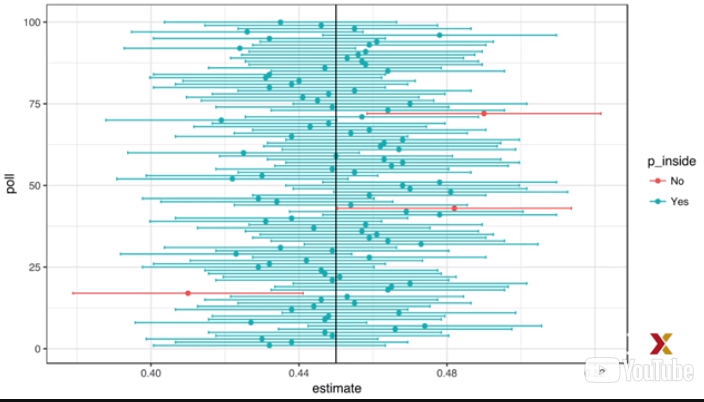

```{r include=FALSE}
library(dplyr)
library(dslabs)
library(ggplot2)
```

### Confidence Intervals

Доверительные интервалы - очень полезная концепция, которая широко используется
учеными по данным.

Вот пример использования некоторых данных о погоде.

```{r}
data("nhtemp")
data.frame(year = as.numeric(time(nhtemp)), temperature=as.numeric(nhtemp)) %>%
  ggplot(aes(year, temperature)) +
  geom_point() +
  geom_smooth() +
  ggtitle("Average Yearly Temperatures in New Haven")
```

Позже мы узнаем, как формируется эта кривая, но обратите внимание на заштрихованную
область вокруг кривой. Эта затененная область создается с использованием концепции
доверительных интервалов. В нашем соискание нас попросили дать интервал. Если выбранный
вами интервал включает фактическую долю p, вы получаете половину денег, потраченных
на ваш опрос, и переходите к следующему этапу конкурса.

Один из способов перейти ко второму этапу конкурса, чтобы сообщить очень большой
интервал - например, интервал $[0, 1]$. Это, как правило, включает в себя p. Однако
с большим интервалом у нас нет шансов выиграть конкурс.

Аналогичным образом, если вы являетесь предводителем выборов и прогнозируете,
что спред будет составлять $[-100, 100]$, вы будете высмеяны за то, что заявили
очевидное. Даже небольшой промежуток времени, например, говоря, что спред будет
составлять $[-10, 10]$, не будет считаться серьезным.

С другой стороны, чем меньше интервал, который мы сообщаем, тем меньше вероятность
перехода ко второму раунду. Аналогичным образом, смелый опросник, который сообщает
о очень малых интервалах и пропускает отметку большую часть времени, не будет
считаться хорошим экспертом. Мы хотим быть где-то посередине. Доверительные интервалы
помогут нам добраться туда.

Мы можем использовать статистическую теорию, которую мы научили вычислять для
любого заданного интервала вероятность включения p. Аналогично, если нас попросят
создать интервал, например, с вероятностью 95% включения p, мы тоже сможем это
сделать. Они называются 95% доверительными интервалами. Обратите внимание, что когда
респонденты сообщают об оценке и погрешности, они, в некотором смысле, сообщают
о доверительном интервале 95%.

Давайте покажем, как это работает математически.

Мы хотим знать вероятность того, что интервал $[\bar X - 2\hat{SE}(\bar X), \bar X +
2\hat{SE}(\bar X)]$ содержит фактическую долю p. Во-первых, обратите внимание,
что начало и конец этого интервала являются случайными. Каждый раз, когда мы берем
образец, они меняются. Чтобы проиллюстрировать это, мы собираемся запустить симуляцию
Монте-Карло. Мы собираемся сделать это только дважды в первую очередь. Поэтому мы будем
использовать эти параметры.

```{r}
p <- 0.45
N <- 1000
X <- sample(c(0, 1), size = N, replace = TRUE, prob = c(1-p, p))
X_hat <- mean(X)
SE_hat <- sqrt(X_hat*(1-X_hat)/N)
c(X_hat - 2*SE_hat, X_hat + 2*SE_hat)
```

**Обратите внимание, что интервал, который мы получаем, когда мы пишем этот код,
отличается от того, что мы получаем, если снова запустим этот же код.**

Если мы будем проводить выборку и создавать интервалы, мы увидим, что это связано
с случайным изменением. Чтобы определить вероятность того, что интервал включает p,
нам нужно вычислить эту вероятность. Вычитая и разделив те же величины во всех частях
уравнения, получим, что уравнение эквивалентно этому.

$$
Pr(\bar X - 2\hat{SE}(\bar X) \leq p \leq \bar X + 2\hat{SE}(\bar X))
$$ 

Термин в середине является приблизительно нормальной случайной величиной с ожидаемым 
значением 0 и стандартной ошибкой 1, которую мы обозначили с большой буквы Z.

$$
Pr(-2 \leq {\bar X - p \over \hat{SE}(\bar X)} \leq 2)
$$$$
Pr(-2 \leq Z \leq 2)
$$

Итак, что у нас есть, какова вероятность того, что стандартная нормальная переменная
находится между -2 и 2? И это, мы знаем, $\approx 95\%$. Таким образом, мы имеем 95% 
доверительный интервал.

Заметим, что если мы хотим иметь большую вероятность, скажем 99%, доверительный
интервал 99%, нам нужно умножить на то, что z удовлетворяет следующему уравнению.

$$
PR(-z \leq Z \leq z) \approx 0.99
$$

Обратите внимание, что с помощью количества, которое мы получаем, набрав этот код,

```{r}
z <- qnorm(0.995)
z
```

потому что по определению pnorm того, что мы получаем при вводе.

```{r}
pnorm(qnorm(0.995))
```

И по симметрии.

```{r}
pnorm(1-qnorm(0.995))
```

Итак, теперь мы вычисляем.

```{r}
pnorm(z) - pnorm(-z)
```

Это то, что мы хотели.

Мы можем использовать этот подход для любого процентиля q. Мы используем $1 - (1 - q)/2.$
Почему это число - из-за того, что мы только что видели, $1 - (1 - q)/2 + (1 - q)/2 = q.$
И мы получаем то, что хотим.

Также обратите внимание, что для получения ровно 0,95 мы фактически используем немного
меньшее число, чем 2.

Откуда нам знать?

Мы вводим 
```{r}
qnorm(0.975)
```
и мы видим, что значение, которое мы должны использовать, чтобы получить точно
доверительный интервал 95%, составляет 1,96.

### A Monte Carlo Simulation for Confidence Intervals

Мы можем запустить симуляцию Монте-Карло, чтобы подтвердить, что на самом деле 
$95\%-ный$ доверительный интервал включает p 95% времени.

Мы пишем симуляцию следующим образом.

```{r}
B <- 10000
inside <- replicate(B, {
  X <- sample(c(0, 1), size = N, replace = TRUE, prob = c(1-p, p))
  X_hat <- mean(X)
  SE_hat <- sqrt(X_hat*(1-X_hat)/N)
  between(p, X_hat - 2*SE_hat, X_hat + 2*SE_hat)
})
mean(inside)
```

Но теперь мы собираемся фактически построить доверительный интервал внутри вызова
для репликации. И в самой последней строке, мы собираемся спросить, входит ли p
в интервал. Мы вернемся либо к истине, либо к ложной. Чтобы вычислить, как часто
это происходит, мы вычисляем среднее значение этого вектора true и false.



Этот график показывает вам первые несколько доверительных интервалов, которые были
сгенерированы в нашем моделировании методом Монте-Карло. В этом случае мы создали
симуляции, чтобы мы знали, что такое p. На графике он представлен вертикальной
черной линией.

**Обратите внимание, что вы можете видеть интервалы доверительного интервала. Каждый
раз они попадают в несколько разных местах. Это потому, что они являются случайными
величинами.**

Мы также знаем, что большая часть времени p входит в доверительный интервал.
p не движется, конечно, потому что p не является случайной величиной. Мы также
видим, что время от времени мы действительно пропускаем p. Эти доверительные интервалы
показаны красным цветом. Мы должны видеть только 5% интервалов в красном, потому что
это 95% доверительные интервалы. Этот график должен помочь нам понять, что такое
доверительные интервалы и что они означают.

### The Correct Language

При использовании теории, которую мы только что описали, важно помнить, что это
интервалы, которые являются случайными, а не p. Мы показали график, где мы могли
видеть случайные интервалы, которые двигались. И мы также видели p. p не двигался.
Он был закреплен, и он был представлен вертикальной линией. Он оставался на том же
месте. Таким образом, 95% относится к вероятности того, что случайный интервал
попадает на вершину p. Говоря, что p имеет 95% -ный шанс быть между ними, и это
технически неверное утверждение - опять же, потому что p не является случайным.

### Power

Опросники не получают успеха за предоставление правильных доверительных интервалов,
а скорее для того, чтобы предсказать, кто победит. Когда мы взяли образец размером 25,
доверительный интервал для распространения был 

```{r}
N <- 25
X_hat <- 0.48
(2*X_hat - 1) + c(-2, 2)*2*sqrt(X_hat*(1-X_hat)/sqrt(N))
```

Это включая 0.

Если бы мы опрашивали, и мы были вынуждены сделать заявление о выборах, у нас не было
бы другого выбора, кроме как сказать, что это подделка. Проблема с результатами наших 
опросов заключается в том, что, учитывая размер выборки и значение p, нам пришлось бы
пожертвовать вероятностью неправильного вызова создать интервал, который не включает 0,
интервал, который вызывает вызов того, кто собирается выиграть.

Тот факт, что наш интервал включает 0, не означает, что эти выборы близки. Это означает,
что мы имеем небольшой размер выборки. В статистических учебниках это называется
недостатком power. В контексте опросов власть можно рассматривать как вероятность
обнаружения разброса, отличного от 0.

Увеличивая наш размер выборки, мы понижаем стандартную ошибку и, следовательно,
имеем гораздо больше шансов обнаружить направление распространения.

### P-Values

p-значения очень распространены, например, в научной литературе. Они связаны с
доверительными интервалами, поэтому мы вводим здесь концепцию.

Давайте рассмотрим пример синих и красных шариков.

Предположим, что вместо того, чтобы оценивать распространение или пропорцию синего,
меня интересует только вопрос, там больше синих бусин, чем красных? Другой способ
спросить это, $2p - 1 > 0?$

Разница больше 0?

Поэтому предположим, что мы возьмем случайный образец, скажем, 100 бусин, и мы
наблюдаем 52 синих шарика. Это дает нам $spread = 4\%$. Это, кажется, указывает на то,
что там больше синих шариков, чем красных шариков, потому что 4% > 0. А 52% > 48%.

Однако, как ученые данных, мы должны быть скептически настроены. Мы знаем, что в этом
процессе есть шанс, и мы можем получить 52, даже если фактический spread = 0. Нулевой
гипотезой является гипотеза скептика. В этом случае это будет spread = 0.

Мы наблюдали случайную переменную $2\bar X - 1 = 0.04$, которая в этом случае равна 4%,
а p-значение является ответом на вопрос, насколько вероятно, что это значение будет
иметь значение, когда истинная нулевая гипотеза верна?

Итак, пишем, какова вероятность того, что $Pr(|\bar X - 0.5| > 0.02)?$ Это то же самое,
что спрашивать, какова вероятность того, что спред составляет 4 или более?

Нулевая гипотеза состоит в том, что разброс равен 0 или p равен половине. При нулевой
гипотезе мы знаем, что эта величина здесь,

$$\sqrt N{\bar X - 0.5 \over \sqrt{0.5(1 - 0.5)}},$$

является стандартной нормой. Мы взяли случайную переменную и разделили ее на стандартную
ошибку после вычитания его ожидаемого значения.

Поэтому мы можем вычислить вероятность, являющуюся р-значением, используя это уравнение,
которое сводится к этому уравнению,

$$
Pr(\sqrt N{|\bar X - 0.5| \over \sqrt{0.5(1 - 0.5)}} > 
\sqrt N{0.02 \over \sqrt{0.5(1 - 0.5)}})
$$

где z - стандартная норма.

```{r}
N <- 100
z <- sqrt(N)*0.02/0.5
1 - (pnorm(z) - pnorm(-z))
```

И теперь мы можем использовать код для вычисления этого. Мы вычисляем вероятность,
равную 69% в этом случае. Это значение p.

В этом случае на самом деле существует большая вероятность увидеть 52 голубые бусинки
или больше при нулевой гипотезой, что существует такое же количество синих бусин,
как красных бусинок.

Таким образом, 52 синие бусины не очень убедительные доказательства, не очень убедительны,
если мы хотим сделать так, что есть больше синих бусин, чем красных. Обратите внимание,
что между значениями p и доверительными интервалами существует тесная связь. Если 95%-ный
доверительный интервал распространения не содержит 0, мы можем сделать немного математики,
чтобы убедиться, что это означает, значение p должно быть меньше $1 - 95\%$ или $0,05$.
Чтобы узнать больше о значениях p, вы можете обратиться к любому учебнику статистики.

Однако в целом мы предпочитаем сообщать доверительные интервалы по значениям p,
поскольку это дает нам представление о размере оценки. Значение p просто сообщает о
вероятности и ничего не говорит о значении поиска в контексте проблемы.