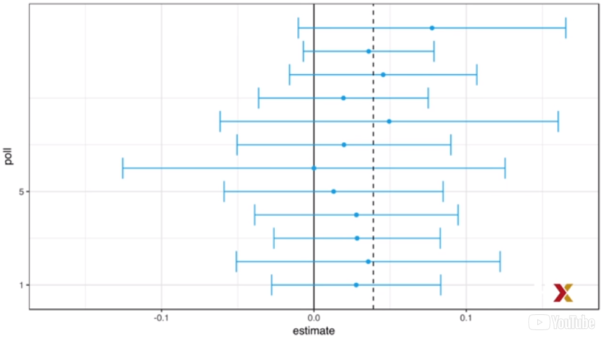
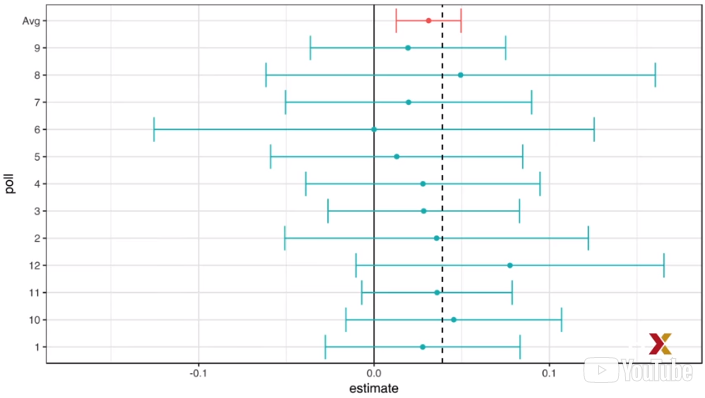

```{r include=FALSE}
library(dplyr)
library(dslabs)
library(ggplot2)
```

### Poll Aggregators

На президентских выборах 2012 года Барак Обама выиграл коллегию выборщиков,
и он выиграл всенародное голосование с перевесом 3,9%. Давайте вернемся
к неделе перед выборами, прежде чем мы узнали об этом результате.

Нейт Сильвер давал Обаме 90% шансов на победу. Тем не менее, ни один из
отдельных опросов не был почти уверен. На самом деле, политический комментатор
Джо Скарборо сказал во время своего шоу: "Любой, кто думает, что эта гонка что
угодно, кроме лотереи прямо сейчас, такой идеолог-это шутник."На что Нейт Сильвер
ответил :" если ты думаешь, что это перебор, давай поспорим. Если Обама победит,
вы пожертвуете 1000 долларов американскому Красному Кресту. Если Ромни выиграет,
то выиграю я.Договорились?"

Почему мистер Сильвер такой уверенный?

Мы проиллюстрируем, что видел Нейт Сильвер, чего не видели Джо Скарборо и другие
эксперты. Мы собираемся использовать Моделирование Монте-Карло. Мы получим результаты
12 опросов за неделю до выборов. Мы собираемся имитировать размеры выборки из фактических опросов. Мы построим и сообщим 95% доверительные интервалы для каждого из этих 12 опросов.

Вот код, который мы собираемся использовать.

```{r}
d <- 0.039
Ns <- c(1298, 533, 1342, 897, 774, 254, 812, 324, 1291, 1056, 2172, 516)
p <- (d + 1)/2

confidence_intervals <- sapply(Ns, function(N) {
  X <- sample(c(0,1), size = N, replace = TRUE, prob = c(1 - p, p))
  X_hat <- mean(X)
  SE_hat <- sqrt(X_hat*(1-X_hat)/N)
  2*c(X_hat, X_hat - 2*SE_hat, X_hat + 2*SE_hat) - 1
})
```

Мы собираемся сгенерировать данные, используя реальный результат, 3,9%. Итак,
разница, спред, составляет 0.039. Размеры выборки были выбраны для имитации
регулярных опросов.

Итак, мы видим, что первый 1,298, второй 533, и так далее. Мы также определим p,
долю демократов - или, на самом деле, долю людей, голосующих за Обаму, как спред
плюс 1, разделенный на 2.

Это формула, которую мы видели раньше.

Затем мы используем функцию sapply для построения доверительных интервалов. Для
каждого размера выборки, для каждого опроса мы создадим выборку. Мы возьмем выборку
размера N. затем мы вычислим долю людей, голосующих за Обаму в этой выборке - это
X_hat - построим стандартную ошибку, а затем вернем оценку X_hat, а также начало
и конец доверительного интервала.

Мы сделаем это, а затем сгенерируем фрейм данных, содержащий все результаты. Вот
результаты 12 опросов, которые мы сгенерировали с помощью моделирования Монте-Карло.

```{r echo=FALSE}
polls <- data.frame(poll=1:ncol(confidence_intervals),
                    t(confidence_intervals),
                    sample_size=Ns)
names(polls) <- c("poll", "estimate", "low", "high", "sample_size")
print(polls)
```

Вот визуальное представление того, что интервалы этих опросов сообщили бы о разнице
между Обамой и Ромни. Неудивительно, что все 12 опросов сообщают о доверительных
интервалах, которые включают результат в ночь выборов, который показан пунктирной
линией.



```{r eval=FALSE}
#код отредактировать
ggplot(polls, aes(estimate, poll)) +
  geom_point() +
  geom_smooth(method = 'loess') 
```

Это так, потому что это 95% доверительные интервалы. Однако все 12 интервалов опроса
включают 0, который показан сплошной черной линией. Поэтому, в индивидуальном порядке,
если бы мы попросили прогноз от опросников, от каждого отдельного опросника, они должны
были бы согласиться со Скарборо.

Это просто перебор.

Теперь мы опишем, как экспертам не хватает ключевой информации. Агрегаторы опросов,
такие как Nate Silver, понимают, что путем объединения результатов различных опросов
можно значительно повысить точность.

Таким образом, фактически мы проводим опрос с огромным размером выборки. В результате
мы можем сообщить о меньшем 95% доверительном интервале и, следовательно, более точном
прогнозе.

Хотя как агрегаторы мы не имеем доступа к исходным данным опроса, мы можем использовать
математику, чтобы восстановить то, что мы получили бы, если бы мы сделали один большой
опрос, в данном случае, 11269 человек, участников.

В основном мы строим оценку спреда-назовем его d - со средневзвешенным значением
следующим образом.

```{r}
d_hat <-polls %>%
  summarize(avg = sum(estimate*sample_size) / sum(sample_size)) %>%
  .$avg
```

Мы в основном умножаем каждый индивидуальный спред на размер выборки. Это даст нам
полный разброс. Затем мы разделим их на общее количество участников нашего
агрегированного опроса. Это дает нам d_hat, который является оценкой d. Как только
у нас есть оценка d, мы можем построить оценку для пропорционального голосования
за Обаму, которую затем мы можем использовать для оценки стандартной ошибки.

```{r}
p_hat <- (1 + d_hat)/2
moe <- 2 * 1.96*sqrt(p_hat*(1-p_hat)/sum(polls$sample_size))
moe
```

Как только мы это сделаем, мы увидим, что наша погрешность агрегированного опроса
составляет 0,018. 

```{r}
round(d_hat *100, 1)
round(moe*100, 1)
```

Таким образом, используя средневзвешенное значение, можно прогнозировать, что спред
составит `r round(d_hat *100, 1)` плюс-минус 1,8%, что не только включает фактический результат, но и довольно далек от 0.

Как только мы объединяем 12 опросов, мы становимся совершенно уверены, что Обама
выиграет всенародное голосование. На этом рисунке красным цветом показан интервал,
созданный с помощью объединенных опросов.



Нейт Сильвер и другие агрегаторы используют тот же подход для прогнозирования коллегии
выборщиков. И они очень хорошо поработали в 2008 и 2012 годах. Однако обратите внимание,
что это была просто симуляция, чтобы проиллюстрировать эту идею. Фактическое научное
упражнение по прогнозированию выборов намного сложнее и включает в себя статистическое
моделирование.

### Pollsters and Multilevel Models

Теперь мы собираемся объяснить, как социологи подходят к многоуровневым моделям
для публичных данных опроса и используют их для прогнозирования результатов выборов.
На президентских выборах 2008 и 2012 годов Нейт Сильвер использовал этот подход,
чтобы сделать почти идеальный прогноз и заставить замолчать экспертов. После выборов
2008 года другие организации создали свои собственные группы прогнозирования выборов,
которые, как и Нейт Сильвер, агрегируют данные опросов и используют статистические
модели для прогнозирования.

В 2016 году прогнозисты сильно недооценили шансы Трампа на победу в выборах. Например,
Принстонский избирательный консорциум дал Трампу менее 1% шансов на победу на выборах,
в то время как Huffington Post дала ему 2% шансов. Напротив, у FiveThirtyEight были
шансы Трампа на победу 29%.

Хотя они не правильно предсказали, что у него будет более высокая вероятность,
обратите внимание, что 29% - это более высокая вероятность, чем вероятность
бросить две монеты и получить два орла. Это также намного, намного больше,
чем предсказывали другие опросы.

Понимая статистические модели и то, как они прогнозисты их используют, мы начнем
понимать, как это произошло.

Хотя это и не так интересно, как предсказание коллегии выборщиков, фактического исхода
выборов, в иллюстративных целях мы начнем с предсказаний для народного голосования.
FiveThirtyEight предсказал 3,6% преимущество для Клинтона. Интервал их предсказания,
включал фактический результат 2,1%, 48,2% для Клинтона по сравнению с 46,1% для Трампа.
Они были гораздо более уверены в том, что Клинтон выиграет это, народное голосование,
давая ей 81,4% шансов на победу. Далее, мы рассмотрим фактические данные опроса
общественного мнения о президентских выборах 2016 года в США, чтобы показать,
как модели мотивированы и построены для получения этих прогнозов.

### Poll Data and Pollster Bias

Мы будем использовать данные общественного опроса, организованного FiveThirtyEight для
президентских выборов 2016 года.  Данные включены как часть пакета dslabs.

```{r}
data("polls_us_election_2016")
names(polls_us_election_2016)
```

В таблице приведены результаты общенациональных и государственных опросов, проведенных
за год до выборов. Для первого примера мы будем фильтровать данные национальных опросов,
что произошло за неделю до выборов. Мы также удаляем опросы, которые FiveThirtyEight
посчитала не надежными, и они оценили их B или меньше. Некоторые опросы не были оценены.
И мы собираемся не использовать их.

Вот код, который мы использовали для фильтрации, как мы только что описали.

```{r}
polls <- polls_us_election_2016 %>%
  filter(state == "U.S." & enddate >= "2016-10-31" & 
           (grade %in% c("A+", "A", "A-", "B+") | is.na(grade)
  ))
```

Мы также добавляем оценку спреда. Помните, что спред, это то, что нам действительно
интересно оценить. Итак, мы вводим этот код, чтобы получить распространение в пропорциях.

```{r}
polls <- polls %>%
  mutate(spread = rawpoll_clinton/100 - rawpoll_trump/100)
```

Для наглядности предположим, что есть только две партии, и назовем p пропорцией
голосования за Клинтон, и 1 - p пропорцией голосования за Трампа. Нас интересует
спред, который мы показали $d = 2p - 1.$ Назовем это распространение d. d-это разница.

Обратите внимание, что у нас есть несколько оценок этого распространения различных
опросов. Теория, которую мы изучили, говорит нам, что эти оценки являются случайной 
величиной с вероятностным распределением, которое приблизительно нормально. Ожидаемое
значение -  спред в ночь выборов, d.

$$
SE = 2\sqrt{p(1-p)/N}
$$

Предполагая, что модель урны, в которой мы описали ранее полезные модели, можем
использовать эту информацию для построения доверительного интервала на основе
агрегированных данных. Оценочный разброс теперь вычисляется так, потому что теперь
размер выборки является суммой всех размеров выборки. И если мы используем это,
получаем стандартную ошибку, набрав код, который затем приводит нас к погрешности
0.0066, очень небольшая погрешность.

```{r}
d_hat <- polls %>%
  summarize(d_hat = sum(spread *samplesize)/sum(samplesize)) %>%
  .$d_hat
p_hat <- (d_hat +1)/2
moe <- 1.96 * 2 * sqrt(p_hat*(1-p_hat)/sum(polls$samplesize))
moe
```

Таким образом, если бы мы собирались использовать эти данные, мы бы сообщили о спреде
1,43% с погрешностью 0,66%. В ночь выборов видим, что фактический процент составляет
2,1%, что находится за пределами 95% доверительного интервала. Итак, что же произошло?

Это было просто невезение?

Гистограмма зарегистрированных спредов показывает другую проблему.

```{r}
polls %>%
  ggplot(aes(spread)) +
  geom_histogram(color = "black", binwidth = 0.01)
```

Данные не распределены нормально, а стандартная ошибка превышает 0,0066. Теория здесь
не совсем работает. Чтобы понять, почему, обратите внимание, что различные опросы
участвуют, а некоторые принимают несколько опросов в неделю.

```{r echo=FALSE}
polls %>% group_by(pollster) %>% summarize(n())
```

Вот Таблица, показывающая, сколько опросов проводил каждый опросник на прошлой неделе.
Давайте визуализируем данные для опросов, которые регулярно опрашивают. Мы пишем это
т фрагмент кода, который сначала фильтрует только опросы, опрашиваемые более 6 раз.
А затем мы просто построим график спредов, оцененных каждым опросником.

```{r}
polls %>% group_by(pollster) %>%
  filter(n() >= 6) %>%
  ggplot(aes(pollster, spread)) +
  geom_point() +
  theme(axis.text.x = element_text(angle = 90, hjust = 1))
```

Каждый из них имеет от пяти до шести. Этот график показывает неожиданный результат.
Во-первых, обратите внимание, что стандартная ошибка, предсказанная теорией для
каждого опроса (теперь мы будем делать этот опрос по опросу) дает нам значения между
0,018 и 0,033.

```{r echo=FALSE}
polls %>% group_by(pollster) %>%
  filter(n() >= 6) %>%
  summarize(se = 2*sqrt(p_hat*(1-p_hat)/median(samplesize)))
```

Это кажется правильным. 

Это, по-видимому, согласуется с тем, что мы видим на графике. Тем не менее, по-видимому,
существуют различия в опросах. Это не объясняется теорией.

```{r echo=FALSE}
polls %>% group_by(pollster) %>%
  filter(n() >= 6) %>%
  summarize(d_hat = sum(spread*samplesize)/sum(samplesize))
```

Обратите внимание, например, как опрос USC Dornsife/LA Times предсказывает выигрыш
в 4% для Трампа, в то время как Ipsos предсказывает выигрыш, превышающий 5% для
Клинтон. Теория learned ничего не говорит о разных опросниках, производящих опросы
с разными ожидаемыми значениями.

Все опросы должны иметь одинаковое ожидаемое значение, фактическое распространение,
распространение, которое мы увидим в ночь выборов. FiveThirtyEight относится к этим
различиям как " эффекты дома." Мы также можем назвать их предвзятостью опроса
общественного мнения. Вместо того, чтобы использовать теорию модели urn, мы вместо
этого собираемся разработать модель, управляемую данными, для получения лучшей оценки
и лучшего доверительного интервала.

### Data-Driven Models

Для каждого опроса давайте соберем из них последний результат перед выборами, используя
этот простой фрагмент кода.

```{r}
one_poll_per_pollster <- polls %>% group_by(pollster) %>%
  filter(enddate == max(enddate)) %>%
  ungroup()
```

Вот гистограмма данных для этих 15 опросов.

```{r}
one_poll_per_pollster %>%
  ggplot(aes(spread)) +geom_histogram(binwidth = 0.01)
```

В предыдущем видео мы видели, что использование теории моделей урн для объединения этих
результатов может быть неуместным из-за эффекта опроса. Вместо этого мы смоделируем эти
данные распространения напрямую.

Новую модель также можно рассматривать как модель урны, хотя связь с идеей урны не такая
прямая. Вместо того, чтобы иметь шарики с нулями и единицами внутри урны, теперь урна
содержит результаты опроса из всех возможных опросов. Мы предполагаем, что ожидаемое
значение нашей урны-это фактический спред, который мы называем d, $d =  2p-1.$ 

Теперь, поскольку вместо нулей и единиц наша урна содержит непрерывные числа от
-1 до 1, стандартное отклонение урны больше не является квадратным корнем из $p(1-p).$

Вместо вариации выборки мы получаем от разных образцов ноль и единицу, стандартная
ошибка для нашего среднего теперь включает в себя изменчивость социологического опроса.
Наша новая урна также включает изменчивость выборки из опроса. Несмотря на это,
стандартное отклонение теперь является неизвестным параметром.

В учебниках статистики для представления этого параметра используется греческий символ
Сигма $\sigma$.

Итак, у нас есть два неизвестных параметра: ожидаемое значение d, которое мы хотим оценить, и стандартное отклонение, $\sigma.$ Наша задача-оценить d и сделать для него вывод.

Поскольку мы моделируем наблюдаемые значения, назовем их $X_1,..,X_N, как случайную
выборку из урны, Центральная предельная теорема все еще работает для среднего из этих
значений, потому что это среднее независимых случайных величин. Для достаточно большого
размера выборки N распределение вероятностей среднего значения выборки, которое мы назовем
$\bar X$, является приблизительно нормальным с ожидаемым значением d и стандартным
отклонением $\sigma/\sqrt{N}$. если мы готовы считать N равным 15 достаточно большим,
мы можем использовать это для построения доверительного интервала.

Однако проблема в том, что мы не знаем $\sigma.$ Но теория говорит нам, что мы можем
оценить $\sigma$ модели урны, ненаблюдаемую $\sigma$ с выборочным стандартным отклонением,
которое определяется вот так с помощью этой математической формулы.

$$
s={1 \over N-1}\sum_{i=1}^{N}(X_i-\bar X)^2
$$

Теперь заметим в математической формуле, что в отличие от среднеквадратического отклонения
популяции, мы теперь делим на $N-1$. Это делает s лучшей оценкой $\sigma,$ чем если бы мы
просто разделили на N.

Этому есть математическое объяснение, которое объясняется в большинстве учебников по
статистике, но здесь мы его не рассматриваем.

Теперь функция sd в R вычисляет стандартное отклонение выборки. Таким образом, мы можем
вычислить его для наших данных здесь с помощью этого простого способа.

```{r}
sd(one_poll_per_pollster$spread)
```

И мы получаем, что 0.024.

Теперь мы готовы сформировать доверительный интервал на основе новых данных модели.
Мы просто используем центральную предельную теорему и создаем доверительный интервал,
используя этот простой код.

```{r}
results <- one_poll_per_pollster %>%
  summarize(avg = mean(spread), se = sd(spread)/sqrt(length(spread))) %>%
  mutate(start = avg - 1.96*se, end = avg + 1.96*se)
round(results *100, 1)
```

Мы получаем среднее значение, стандартную ошибку, а затем начало 1,7% и конец 4,1%.
Это наш 95% доверительного интервала с данными модели. Обратите внимание, что наш
новый доверительный интервал шире, и теперь он включает вариабельность опроса.
Он включает в себя результат выборов 2,1%, а также он достаточно мал, чтобы не включать 0.

Это означает, что в данном конкретном случае мы были быть вполне уверены, что Клинтон
выиграет всенародное голосование.

Итак, готовы ли мы сейчас объявить вероятность Победы Клинтон, как это делают социологи?
Еще нет
.
В нашей модели d, является фиксированным параметром, поэтому мы не можем говорить о
вероятностях. Чтобы обеспечить вероятности, нам нужно узнать что-то новое. Нам придется
изучить байесовскую статистику. И мы сделаем это в следующий раз.