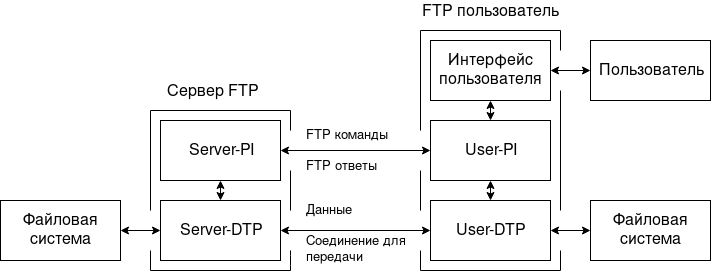

<h1 align="center">File Transfer Protocol (FTP)</h1>

FTP - протокол передачи файлов и данных по сети между компьютерами.

**Целью FTP являются:**
1. способствовать обмену файлами (компьютерных программ и/или данных),
2. поддерживать косвенное или скрытое (через программы) использование
удаленных компьютеров,
3. защитить пользователя от изменения в системе хранения файлов между 
хостами,
4. передовать данные надежно и эфективно.

FTP, хоть он используется пользователем непосредственно через терминал,
но предназначался в основном для использования программами.

## История

FTP эволюционировал долгие годы. Первый механизм передачи файлов был 
предложен в 1971 году. Он был реализован для хост машин M.I.T. 
([RFC 114](https://tools.ietf.org/html/rfc114)), в добавок вышли 
комментарии и дискусии [RFC 141](https://tools.ietf.org/html/rfc141). 
Протокол был разработан для работы на двух хостах M.I.T., GE645/Multics 
и PDP-10/DM/CG-ITS (и возможно в Гарварде PDP-10).

В протокол добавляли новые возможности, исправляли ошибки, например в 
[RFC 172](https://tools.ietf.org/html/rfc172) предоставлял протокол 
ориентированный на пользовательский уровень для передачи файла между 
хостами компьютеров (включая терминал IMP). 
[RFC 354](https://tools.ietf.org/html/rfc354) был определен как протокол 
для передачи фаилов между хостами в 
[ARPANET](https://ru.wikipedia.org/wiki/ARPANET). 
[RFC 385](https://tools.ietf.org/html/rfc385) были проккоментированы 
ошибки. Официальный FTP документ был опубликован как 
[RFC 454](https://tools.ietf.org/html/rfc454).

К июлю 1973 года, были сделаны значительные изменения протокола, 
документ [RFC 542](https://tools.ietf.org/html/rfc542) стал новой 
спецификацией протокола, чтобы отразить эти изменения. Но основная 
структура осталась прежней. Однако многие реализации основанные на 
старой спецификации небыли обновлены.

В 1974 году продолжилось комментирование протокола и незначительные 
изменение. В 1975 году, [RFC 686](https://tools.ietf.org/html/rfc686)
было обсуждено различие между всеми версиями FTP. Июнь 1980 года FTP 
начал работать в сети TCP, [RFC 765](https://tools.ietf.org/html/rfc765)

[RFC 959](https://tools.ietf.org/html/rfc959) Содержит незначительные
исправления, улучшено объяснение некоторых функций протокола и добавление
новых необязательных команд. Эта спецификация является последней по 
изменению FTP, последующие спецификации не влияли на стандарт 
работы протокола. Добавления в виде шифровании,  расширения 
безопасности, расширения комманд итд.

## FTP модель

Рисунок 1, FTP модель.

> 1. Соединение данных может использоваться в любом направлении.
> 2. Соединение данных не обязательно должно существовать постоянно.

В модели изображенной на рисунке 1, user-PI инициализирует управляющее
соединение. Которое придерживается Telnet протоколу. При инициализации 
пользователя стандартные команды FTP генерируются user-PI и передаются 
на серверному процессу через управляющее соединение. (Пользователь может
установить прямое управляющее соединение с server-FTP из TAC терминала
для примера, и самостоятельно генерировать стандартные команды FTP минуя
процесс user-PI). Стандартные ответы отправляются с server-PI на user-PI
через управляющее соединение в ответ на команды.

FTP команды задают параметры для соединения передачи данных (порт, режим
передачи, тип представления и структура) и характера работы файловой 
системы (сохранение, извлечение, добавление, удаление и т.д.). User-DTP
или его назначение должно прослушивать указанный порт данных, а сервер 
инициализирует подключение для передачи данных и передает данные в 
соответствии с указаными параметрами. Следует отметить что порт данных
не должен находиться на том же хосте, который инициирует команды FTP 
через управлеяющее соединение, но пользователь или user-FTP процесс 
должен обеспечить прослушивание в указанный порт данных. Следует также 
отметить, что соединение для передачи данных может использоваться для 
одновременной отпревки и получения.

